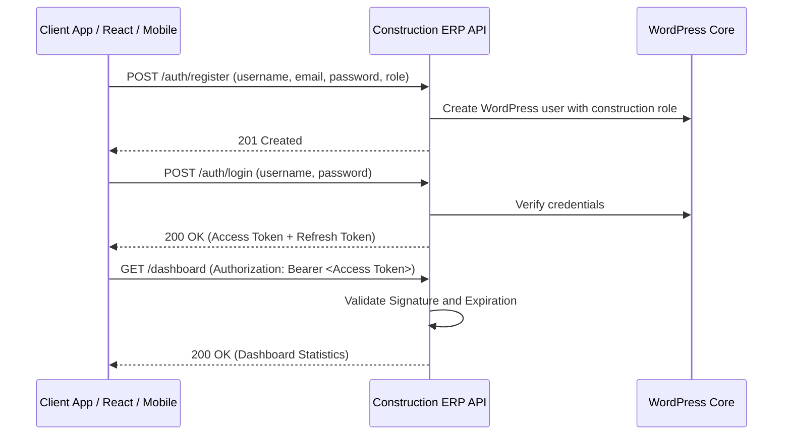

# Construction Management API - Operations & Integration Guide

This guide provides a comprehensive overview of the **Construction ERP API** WordPress plugin, including its architectural design, role-based access control, test credentials, and client endpoints workflow.

---

## 1. Plugin Contents & Modules

The plugin exposes a WordPress REST API under the `/wp-json/construction-management/v1` namespace.

| Module | Core Functionality | Database Table |
| :--- | :--- | :--- |
| **Authentication** | JWT secure token registration, login, logout, and token rotation. | Standard `wp_users` & `wp_usermeta` |
| **Projects** | Manage structural development projects, managers, estimated and actual costs. | `wp_construction_projects` |
| **Milestones** | Stages planning linked to projects with completion percentages. | `wp_construction_milestones` |
| **Materials** | Manage available inventory, unit listings, minimum stock counts, and prices. | `wp_construction_materials` |
| **Purchases** | Log purchase orders, quantities ordered, unit rates, GST additions, and PO status. | `wp_construction_purchases` |
| **Suppliers** | Supplier contact records, address fields, and quality ratings. | `wp_construction_suppliers` |
| **Site Expenses** | Log utility bills, fuel purchases, and JCB rental expenses. | `wp_construction_site_expenses` |
| **Contractors** | Contractor database tracking contract values, specialties, and statuses. | `wp_construction_contractors` |
| **Labour** | Workforce details listing worker names, trade categories, daily wages, and status. | `wp_construction_labours` |
| **Attendance** | Log daily labour attendance, working hours, and overtime hours. | `wp_construction_attendance` |
| **Payroll** | Monthly and weekly payroll calculations and payslip entries (1.5x overtime rate). | `wp_construction_payroll` |
| **Progress** | Category updates detailing planned vs actual percentages and site photos. | `wp_construction_progress` |
| **Equipment** | Manage concrete mixers, JCB excavators, purchase and rental costs, and locations. | `wp_construction_equipment` |
| **Billing** | Client invoicing tracking GST amounts, billing dates, and payment status. | `wp_construction_billing` |
| **Documents** | Maintain contracts, BOQs, drawings, and invoice files references. | `wp_construction_documents` |
| **Audit Logs** | Track administrator transactions, logging actions and IP addresses. | `wp_construction_activity_logs` |

---

## 2. Authentication & JWT Login Flow

The plugin secures REST endpoints via **JWT (JSON Web Token)** using the standard `HS256` encryption algorithm.



### Default Client Test Credentials

During plugin activation, standard mock user accounts are generated automatically for testing:

| Username | Password | Assigned Role | Capabilities / Permissions |
| :--- | :--- | :--- | :--- |
| `constsuperadmin` | `123456` | `construction_super_admin` | Full control over settings, users, approvals, and reports costing |
| `constprojectmanager` | `pmtest123` | `construction_project_manager` | Manage assigned projects, progress tracking, and contractor details |
| `constsiteengineer` | `engineertest123` | `construction_site_engineer` | Log daily progress, register labour attendance, and view inventory |
| `constpurchasemanager` | `purchasetest123` | `construction_purchase_manager` | Manage materials catalog and coordinate purchase orders |
| `constcontractor` | `contractortest123` | `construction_contractor` | View assigned projects and check milestones status |
| `constaccountant` | `accountanttest123` | `construction_accountant` | Log site expenses, create client invoices, and view payroll |

### User Registration OTP & Approval Flow

- **OTP Dispatch**: New user registrations require 2-step verification. Initiating registration sends a 6-digit verification code to the requested email address.
- **Approval Requirement**: All new user registrations (except `construction_super_admin`) receive a default status of `PENDING` upon registration.
- **Login Behavior**: Pending users can successfully login and receive a JWT token, but will be intercepted by the UI and shown a message: *"Soon construction_super_admin will approve and you will be having access of your panel."*
- **Super Admin Review Page**: Under the **User Approvals** tab, the Super Admin can review registered accounts and set their status to `APPROVED`, `HOLD`, or `BLOCKED`, or permanently `DELETE` them.

### Authentication Endpoints

#### 1. Initiate Registration (OTP Request)
* **Endpoint**: `POST /wp-json/construction-management/v1/auth/register`
* **Request Payload**:
  ```json
  {
    "username": "engineer_sharma",
    "email": "sharma@construction.erp",
    "password": "securepassword123",
    "name": "Sharma Kumar",
    "role": "construction_site_engineer"
  }
  ```
* **Response**: OTP code is dispatched via email and temporary registration details are stored in a WordPress transient.

#### 2. Verify OTP & Create User
* **Endpoint**: `POST /wp-json/construction-management/v1/auth/register/verify`
* **Request Payload**:
  ```json
  {
    "email": "sharma@construction.erp",
    "otp": "839201"
  }
  ```
* **Response**: Registers user account in WordPress and sets the status to `PENDING` (needs super admin approval).

#### Log In to Retrieve Tokens
* **Endpoint**: `POST /wp-json/construction-management/v1/auth/login`
* **Request Payload**:
  ```json
  {
    "username": "constsuperadmin",
    "password": "123456"
  }
  ```
* **Response Payload**:
  ```json
  {
    "success": true,
    "message": "Authentication successful",
    "data": {
      "token": "eyJhbGciOiJIUzI1NiIsInR5cCI6IkpXVCJ9...",
      "refresh_token": "eyJhbGciOiJIUzI1NiIsInR5cCI6IkpX...",
      "user": {
        "id": 5,
        "username": "constsuperadmin",
        "email": "admin@construction.erp",
        "name": "Construction Super Admin",
        "role": "construction_super_admin",
        "status": "APPROVED"
      }
    }
  }
  ```

---

## 3. Role-Based Access Control Matrix (RBAC)

Endpoints enforce access criteria mapped to roles:

| Action / Capability | Super Admin | Project Manager | Site Engineer | Purchase Manager | Contractor | Accountant |
| :--- | :---: | :---: | :---: | :---: | :---: | :---: |
| **Manage Users & Settings** | Yes | No | No | No | No | No |
| **Manage Projects & Milestones**| Yes | Yes | No | No | No | No |
| **CRUD Inventory / Materials** | Yes | No | Yes | Yes | No | No |
| **Log Purchase Orders (PO)** | Yes | No | No | Yes | No | No |
| **Labour Workforce Management** | Yes | No | Yes | No | No | No |
| **Attendance Logging** | Yes | No | Yes | No | No | No |
| **Payroll Calculation Slips** | Yes | No | No | No | No | Yes |
| **Log Site Expenses Vouchers** | Yes | No | No | No | No | Yes |
| **Noticeboard / Progress Logging**| Yes | Yes | Yes | No | No | No |
| **View Details / Dashboards** | Yes | Yes | Yes | Yes | Yes | Yes |

*Protected requests require including the retrieved JWT string in the headers:*
```http
Authorization: Bearer <your_jwt_token>
```

---

## 4. Swagger UI Documentation

Access the interactive visual Swagger UI playground to execute mock requests and inspect response schemas:
* **Playground URL**: `/construction-management-api-docs/`

---

## 5. Modern Operations Dashboard

The plugin serves a modern dashboard for live construction site management:
* **Dashboard URL**: `/construction-management/`
* **Features**: Displays active projects/milestones progress indicators, material inventory metrics, site expenses logs, and animated bar charts representing budget vs actual allocations.
