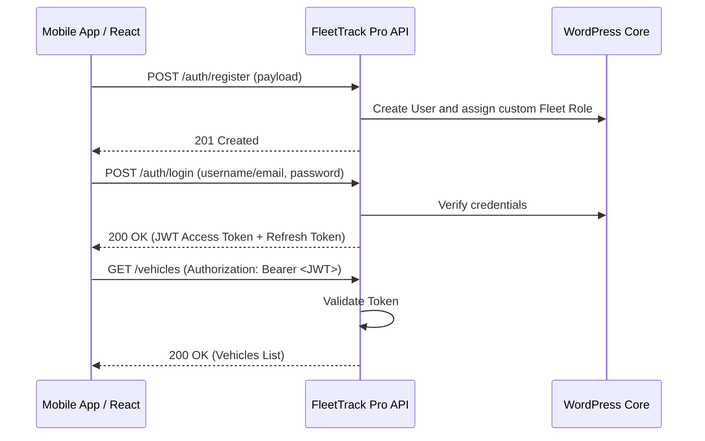

# FleetTrack Pro API - Operations & Integration Guide

This document provides a comprehensive overview of the **FleetTrack Pro API** WordPress plugin features, authentication logic, role permissions, and financial calculations.

---

## 1. Plugin Contents & Modules

The plugin exposes an enterprise-grade REST API structured under the `/wp-json/fleet-track/v1` namespace.

| Module | Core Functionality | Database Table |
| :--- | :--- | :--- |
| **Authentication** | Secure JWT session management, registration, and refresh token rotation. | Standard `wp_users` & `wp_usermeta` |
| **Vehicles** | Manage logistics assets, types, dimensions, and structural specifications. | `wp_fleet_vehicles` |
| **Drivers** | Track licenses, joining dates, contact details, and base monthly salaries. | `wp_fleet_drivers` |
| **Routes** | Define source and destination coordinates, distance, and ETA limits. | `wp_fleet_routes` |
| **Trips** | Record logistics journeys, odometer readings, status, and generated revenue. | `wp_fleet_trips` |
| **Expenses** | Log operational expense categories (toll, permits, maintenance, repairs, etc.). | `wp_fleet_expenses` |
| **Fuel Logs** | Log diesel/petrol purchases, fuel quantities, rates, and station names. | `wp_fleet_fuel` |
| **Documents** | Map document file attachments (RC, License, Aadhaar, PAN) with expiry dates. | `wp_fleet_documents` |
| **Audit Logs** | Security trail logging IP addresses and administrative operations. | `wp_fleet_activity_logs` |

---

## 2. Authentication & Login Workflow

The plugin secures REST endpoints via **JWT (JSON Web Token)** using the standard `HS256` encryption algorithm with a secret key generated on activation.



### Default Test Credentials

During plugin activation, four default test user accounts are automatically created for quick testing on Swagger:

| Username | Password | Assigned Role | Permissions |
| :--- | :--- | :--- | :--- |
| `fleet_admin` | `adminpassword123` | `fleet_super_admin` | Full control and analytics |
| `fleet_manager` | `managerpassword123` | `fleet_manager` | Manage vehicles, drivers, trips, expenses |
| `fleet_accountant` | `accountantpassword123` | `fleet_accountant` | Read access + record expenses |
| `fleet_driver` | `driverpassword123` | `fleet_driver` | View assigned trips, update status |

### Authentication Endpoints

#### Register a User
- **Endpoint**: `POST /wp-json/fleet-track/v1/auth/register`
- **Request Payload**:
  ```json
  {
    "username": "driver_ramesh",
    "email": "ramesh@example.com",
    "password": "securepassword123",
    "name": "Ramesh Seervi",
    "role": "fleet_driver"
  }
  ```
  *(Valid role values: `fleet_super_admin`, `fleet_manager`, `fleet_accountant`, `fleet_driver`)*

#### Log In
- **Endpoint**: `POST /wp-json/fleet-track/v1/auth/login`
- **Request Payload**:
  ```json
  {
    "username": "driver_ramesh",
    "password": "securepassword123"
  }
  ```
- **Response**:
  ```json
  {
    "success": true,
    "message": "Login successful",
    "data": {
      "token": "eyJhbGciOiJIUzI1NiIsInR5cCI6IkpXVCJ9.ey...",
      "refresh_token": "eyJhbGciOiJIUzI1NiIsInR5cCI6Ikp...",
      "user": {
        "id": 12,
        "username": "driver_ramesh",
        "email": "ramesh@example.com",
        "name": "Ramesh Seervi",
        "role": "fleet_driver"
      }
    }
  }
  ```

#### Refresh Token
- **Endpoint**: `POST /wp-json/fleet-track/v1/auth/refresh-token`
- **Request Payload**: `{ "refresh_token": "<token>" }`

#### Authorized Requests
To interact with protected endpoints, append the received `token` in the HTTP header:
```http
Authorization: Bearer <your_jwt_token>
```

---

## 3. User Roles & Access Privileges (RBAC)

The plugin registers custom user privileges. Endpoints enforce role validations through capability mappings:

| User Role | Dashboard | Vehicles/Drivers | Trips Management | Expense Logs | Analytics / Reports |
| :--- | :---: | :---: | :---: | :---: | :---: |
| **Fleet Super Admin** | Full | Full CRUD | Full CRUD | Full CRUD | Full (all financial sheets) |
| **Fleet Manager** | View | Full CRUD | Full CRUD | Full CRUD | View reports |
| **Accountant** | View | View Only | View Only | Full CRUD | View Financial Reports |
| **Driver** | None | None | View Assigned | None | None |

*Capabilities created:*
- `manage_fleet` (Super Admin, Fleet Manager)
- `view_fleet` (Super Admin, Fleet Manager, Accountant)
- `manage_vehicles` (Super Admin, Fleet Manager)
- `view_vehicles` (Super Admin, Fleet Manager, Accountant)
- `manage_drivers` (Super Admin, Fleet Manager)
- `view_drivers` (Super Admin, Fleet Manager, Accountant)
- `manage_trips` (Super Admin, Fleet Manager)
- `view_trips` (Super Admin, Fleet Manager, Accountant, Driver)
- `update_trip_status` (Super Admin, Fleet Manager, Driver)
- `manage_expenses` (Super Admin, Fleet Manager, Accountant)
- `view_expenses` (Super Admin, Fleet Manager, Accountant)
- `view_reports` (Super Admin, Fleet Manager, Accountant)
- `upload_documents` (Super Admin, Fleet Manager, Accountant, Driver)

---

## 4. Automatic Cost & Profit Calculations

The plugin computes core metrics dynamically to track profitability:

### A. Automatic Expense Cost Syncing
When a fuel log purchase is saved via `POST /fuel`, the system automatically inserts a corresponding record into the expenses table of type `Fuel` containing the cost, price, fuel station description, and trip connection context. This guarantees that total expense calculations are always up-to-date.

### B. Dynamic Financial Formulas (Dashboard & Reports)

```
[Net Profit] = [Trip Revenue] - [Total Expenses]
```
- **Trip Revenue**: Calculated from the sum of `revenue` for all completed trips inside `wp_fleet_trips`.
- **Total Expenses**: Sum of all logged amounts inside `wp_fleet_expenses` (including fuel cost syncs, driver salary records, toll fees, maintenance, tyres, insurance, and parking).

```
[Cost Per Kilometer (CPK)] = [Total Expenses] / [Total Distance Travelled]
```
- **Total Distance Travelled**: Calculated from the difference between trip end/start odometers (`end_km - start_km`) or distance inputs in logged trips.

### C. Driver Utilization
Calculates operational indicators for each driver:
- **Total Trips**: Total trips assigned.
- **Total Distance**: Total kilometers driven.
- **Total Revenue**: Total cargo revenue generated.
- **Average Revenue per Trip**: `Total Revenue / Trips Count`.

---

## 5. Swagger Interface Endpoint

Access the interactive visual testing client directly:
- **URL Path**: `https://rpsdigitalworld.store/fleettrack-api-docs/`
- **Utility**: Allows administrators to input Bearer keys, test API responses, upload document file types (up to 20MB), and review request formats.

---

## 6. Frontend Logistics Dashboard Panel

A premium night-themed frontend dashboard is included directly in the plugin to manage operations visually:

- **Dashboard URL**: `https://rpsdigitalworld.store/fleet-track/`
- **Utility**: Renders interactive tabs for **Overview Metrics**, **Vehicles Inventory**, **Drivers Directory**, **Routes Directory**, **Trips Registry**, **Fuel & Expenses logs**, and **Financial Reports**. Supports real-time client-side CRUD operations and custom report generations within date range parameters.
