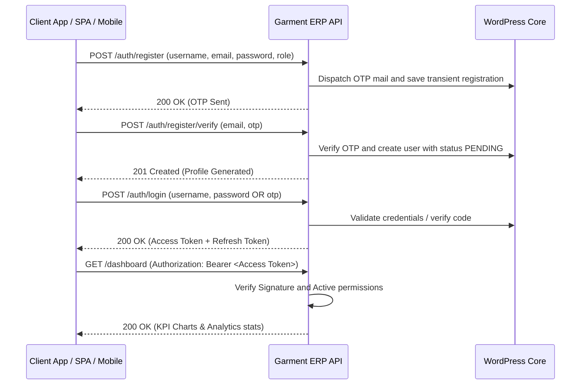

# Garment & Textile ERP API - Operations & Integration Guide

This guide provides a comprehensive overview of the **Garment Textile ERP API** WordPress plugin, including its architectural design, database tables, role-based access control (RBAC), test credentials, and client endpoints workflow.

---

## 1. Plugin Contents & Modules

The plugin exposes a WordPress REST API under the `/wp-json/garment-management/v1` namespace.

| Module | Core Functionality | Database Table |
| :--- | :--- | :--- |
| **Authentication** | Secure JWT tokens, register OTPs, login, logout, and token rotation. | Standard `wp_users` & `wp_usermeta` |
| **Customer Orders** | Sales orders tracking customer name, style code, quantities, and delivery status. | `wp_garment_orders` |
| **Fabric Stock** | Fabric roll stock tracking meters, colors, type, width, GSM, and cost. | `wp_garment_fabrics` |
| **Accessories Stock** | Track items like buttons, zippers, labels, threads, and packaging. | `wp_garment_accessories` |
| **Suppliers** | B2B supplier directory tracking contact details, addresses, and ratings. | `wp_garment_suppliers` |
| **Purchases** | Restocking PO purchases logging fabric/accessory item receipts. | `wp_garment_purchases` |
| **BOM Formula** | Bill of Materials mapping style codes to required fabrics and accessories. | `wp_garment_bom` |
| **Production Planning** | Schedule targets for finished apparel items, linked to sales orders. | `wp_garment_production_plans` |
| **Fabric Cutting** | Fabric cut runs tracking planned vs. actual pieces, layers, and wastage. | `wp_garment_cutting` |
| **Stitching Line** | Stitching batch records tracking workers, sewing machine codes, target vs. completed pcs. | `wp_garment_stitching` |
| **Finishing Line** | Ironing, thread cutting, folding, packing, and labeling logs. | `wp_garment_finishing` |
| **Worker Directory** | Factory workers roster tracking designations, attendance status, and wage types. | `wp_garment_workers` |
| **Payroll Runs** | Wage calculations (monthly salary, daily wage, or piece-rate payments). | `wp_garment_payroll` |
| **Quality Control** | Inspections logs capturing approved vs. rejected quantities with defect notes. | `wp_garment_quality` |
| **Wastage Tracking** | Departmental wastage records and cost impacts. | `wp_garment_wastage` |
| **Logistics Dispatch** | Shipments records tracking driver name, transport company, and tracking codes. | `wp_garment_dispatch` |
| **Inventory Logs** | Stock movement ledger transaction logs tracking fabric/accessory issues. | `wp_garment_inventory` |
| **Machinery Index** | Factory machinery inventory tracking maintenance schedules. | `wp_garment_machines` |
| **Audit Logs** | System activity tracker logging admin actions, logins, and IP addresses. | `wp_garment_activity_logs` |

---

## 2. Authentication & JWT Login Flow

The plugin secures REST endpoints via **JWT (JSON Web Token)** using the standard `HS256` encryption algorithm.



### Default Client Test Credentials

During plugin activation, standard mock user accounts are generated automatically for testing:

| Username | Password | Assigned Role | Capabilities / Permissions |
| :--- | :--- | :--- | :--- |
| `garmentsuperadmin` | `123456` | `garment_super_admin` | Full control over settings, users, approvals, and financials. |
| `gmt_production` | `productionpass123` | `garment_production_manager` | Manage plans, BOM formulations, cutting, stitching, and quality. |
| `gmt_inventory` | `inventorypass123` | `garment_inventory_manager` | Manage fabric stocks, accessories bins, purchases, and suppliers. |
| `gmt_supervisor` | `supervisorpass123` | `garment_supervisor` | Manage worker attendance, allocations, and stitching monitors. |
| `gmt_quality` | `qualitypass123` | `garment_quality_inspector` | Inspect work orders output, approve/reject volumes, log defect notes. |
| `gmt_dispatch` | `dispatchpass123` | `garment_dispatch_manager` | Access dispatch logs, logistics dispatches, and delivery dispatches. |

### User Registration OTP & Approval Flow

- **OTP Dispatch**: New operator profiles require email verification. Initiating registration triggers a 6-digit OTP code to the requested email address.
- **Approval Requirement**: All new operator registrations receive a status of `PENDING` upon registration.
- **Login Behavior**: Pending operators can log in and retrieve tokens, but the SPA dashboard will intercept them with a notice: *"Soon garment_super_admin will approve and you will be having access of your panel."*
- **Super Admin Review Page**: Under the **Diagnostics & Users** tab, the Super Admin can review accounts and toggle statuses between `APPROVED`, `HOLD`, and `BLOCKED`, or permanently delete profiles.

### Authentication Endpoints

#### 1. Initiate Registration (OTP Request)
* **Endpoint**: `POST /wp-json/garment-management/v1/auth/register`
* **Request Payload**:
  ```json
  {
    "username": "cutter_tom",
    "email": "tom@gmt.erp",
    "password": "securepassword123",
    "name": "Tom Cutter",
    "role": "garment_supervisor"
  }
  ```
* **Response**: OTP verification mail is dispatched and temporary registration is stored.

#### 2. Verify OTP & Create User
* **Endpoint**: `POST /wp-json/garment-management/v1/auth/register/verify`
* **Request Payload**:
  ```json
  {
    "email": "tom@gmt.erp",
    "otp": "123456"
  }
  ```
* **Response**: Activates the profile inside the WordPress users table with `PENDING` status.

#### 3. Log In to Retrieve Tokens
* **Endpoint**: `POST /wp-json/garment-management/v1/auth/login`
* **Request Payload**:
  ```json
  {
    "username": "garmentsuperadmin",
    "password": "123456"
  }
  ```
* **Response Payload**:
  ```json
  {
    "success": true,
    "message": "Authentication successful",
    "data": {
      "access_token": "eyJhbGciOiJIUzI1NiIsInR5cCI6IkpXVCJ9...",
      "refresh_token": "eyJhbGciOiJIUzI1NiIsInR5cCI6IkpX...",
      "user": {
        "id": 20,
        "username": "garmentsuperadmin",
        "email": "garmentadmin@garment.erp",
        "name": "Garment Super Admin",
        "role": "garment_super_admin",
        "status": "APPROVED"
      }
    }
  }
  ```

#### 4. Refresh Session
* **Endpoint**: `POST /wp-json/garment-management/v1/auth/refresh-token`
* **Request Payload**:
  ```json
  {
    "refresh_token": "<refresh_token_string>"
  }
  ```

---

## 3. Role-Based Access Control Matrix (RBAC)

Endpoints enforce capability requirements mapped to roles:

| Action / Capability | Super Admin | Production Mgr | Inventory Mgr | Supervisor | Quality Inspector | Dispatch Mgr |
| :--- | :---: | :---: | :---: | :---: | :---: | :---: |
| **Manage Users & Settings** | Yes | No | No | No | No | No |
| **View Reports & Dashboard** | Yes | Yes | No | No | No | No |
| **Manage Orders & BOM** | Yes | Yes | No | No | No | No |
| **Manage Fabric/Accessory Stock** | Yes | No | Yes | No | No | No |
| **Manage Cutting & Stitching** | Yes | Yes | No | Yes | No | No |
| **Manage Worker Attendance** | Yes | No | No | Yes | No | No |
| **Submit Quality Inspections**| Yes | Yes | No | No | Yes | No |
| **Book Logistics Dispatches** | Yes | No | No | No | No | Yes |

*Protected REST requests require including the retrieved JWT Bearer string in the headers:*
```http
Authorization: Bearer <your_jwt_token>
```

---

## 4. Interactive API Playground Sandbox Docs

Access the interactive visual Swagger UI docs playground to execute mock requests and inspect response schemas:
* **Playground URL**: `/garment-management-api-docs/`

---

## 5. Modern Operations Dashboard

The plugin serves a modern premium dark-themed single page dashboard for operations:
* **Dashboard URL**: `/garment-management/`
* **Features**: Style BOM configurations builder, fabric cutting parameters planner, stitching output counters, worker rosters daily attendance panels, payroll slips wage calculations, QC defect checklists, shipments logistics logs, and SMTP email diagnostics.
