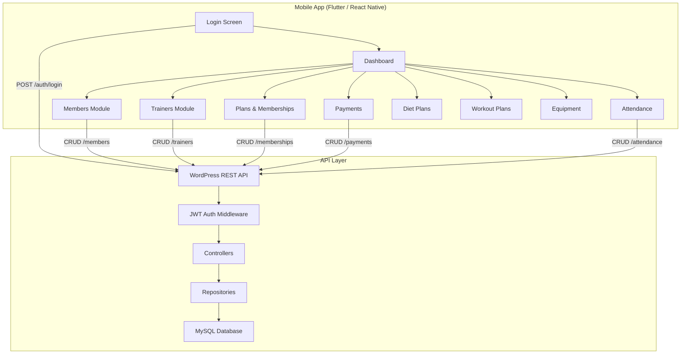
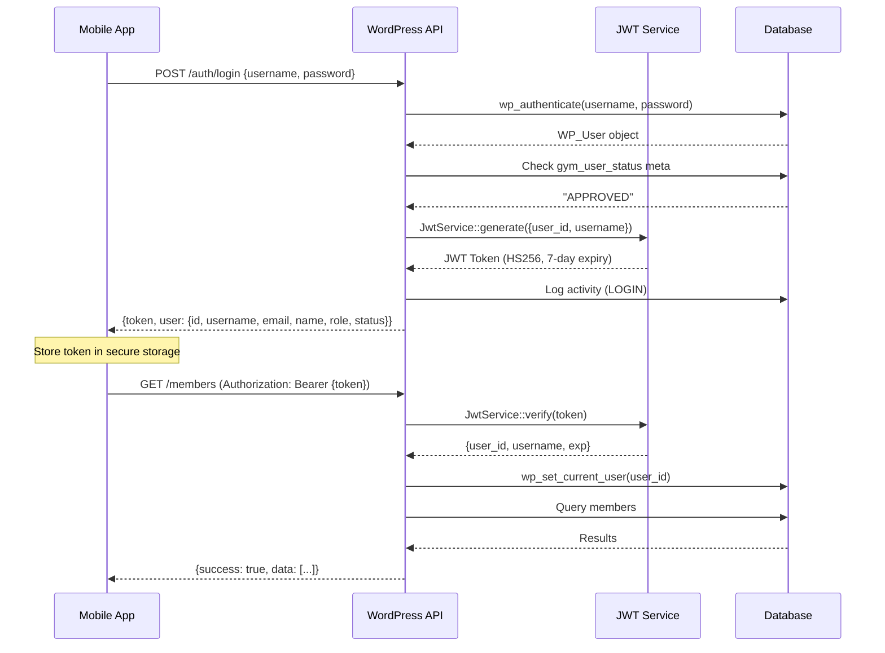

# Gym Management ERP — Complete System Overview & API Documentation

> **For Mobile App & Full-Stack Development**

---

## Table of Contents

1. [System Architecture](#1-system-architecture)
2. [Database Schema (10 Tables)](#2-database-schema)
3. [Authentication & JWT Flow](#3-authentication--jwt-flow)
4. [API Conventions (Pagination, Search, Errors)](#4-api-conventions)
5. [Complete API Reference (All Endpoints)](#5-complete-api-reference)
   - [5.1 Auth (3 endpoints)](#51-authentication)
   - [5.2 Dashboard (1 endpoint)](#52-dashboard)
   - [5.3 Members (5 endpoints)](#53-members)
   - [5.4 Trainers (3 endpoints)](#54-trainers)
   - [5.5 Plans (2 endpoints)](#55-plans)
   - [5.6 Memberships (3 endpoints)](#56-memberships)
   - [5.7 Payments (2 endpoints)](#57-payments)
   - [5.8 Diet Plans (2 endpoints)](#58-diet-plans)
   - [5.9 Attendance (2 endpoints)](#59-attendance)
   - [5.10 Workout Plans (5 endpoints)](#510-workout-plans)
   - [5.11 Equipment (6 endpoints)](#511-equipment)
6. [Mobile App Architecture Blueprint](#6-mobile-app-architecture-blueprint)
7. [Role-Based Access Control (RBAC)](#7-role-based-access-control)
8. [Postman Testing Guide](#8-postman-testing-guide)

---

## 1. System Architecture



| Component | Technology | Details |
|:--|:--|:--|
| **Backend** | WordPress REST API (PHP) | Namespace: `gym/v1` |
| **Auth** | Custom JWT (HS256) | 7-day token expiry |
| **Database** | MySQL (WordPress `$wpdb`) | 10 custom tables + `wp_users` |
| **CORS** | Full open CORS | `Access-Control-Allow-Origin: *` |
| **Architecture** | MVC + Repository pattern | Controllers → Repositories → DB |
| **Soft Delete** | All tables (except Attendance & Activity Logs) | `deleted_at` column |
| **API Base URL** | `{site_url}/wp-json/gym/v1` | All endpoints under this prefix |

---

## 2. Database Schema

### 2.1 Members Table — `wp_gym_members`

| Column | Type | Constraints | Description |
|:--|:--|:--|:--|
| `id` | `BIGINT(20) UNSIGNED` | PK, AUTO_INCREMENT | Internal ID |
| `member_id` | `VARCHAR(50)` | UNIQUE, NOT NULL | Auto-generated code (e.g., `MEM-00001`) |
| `name` | `VARCHAR(150)` | NOT NULL | Full name |
| `mobile` | `VARCHAR(20)` | — | Phone number |
| `email` | `VARCHAR(100)` | — | Email address |
| `dob` | `DATE` | — | Date of birth |
| `gender` | `VARCHAR(20)` | — | Male/Female/Other |
| `blood_group` | `VARCHAR(10)` | — | Blood group |
| `address` | `TEXT` | — | Full address |
| `emergency_contact_name` | `VARCHAR(100)` | — | Emergency contact person |
| `emergency_contact_number` | `VARCHAR(20)` | — | Emergency phone |
| `join_date` | `DATE` | — | Joining date |
| `height_cm` | `DECIMAL(5,2)` | — | Height in centimeters |
| `weight_kg` | `DECIMAL(5,2)` | — | Weight in kilograms |
| `medical_history` | `TEXT` | — | Medical notes |
| `status` | `VARCHAR(20)` | DEFAULT `'Active'` | Active / Inactive |
| `created_at` | `DATETIME` | DEFAULT CURRENT_TIMESTAMP | Record creation time |
| `deleted_at` | `DATETIME` | DEFAULT NULL | Soft delete timestamp |

---

### 2.2 Trainers Table — `wp_gym_trainers`

| Column | Type | Constraints | Description |
|:--|:--|:--|:--|
| `id` | `BIGINT(20) UNSIGNED` | PK, AUTO_INCREMENT | Internal ID |
| `name` | `VARCHAR(150)` | NOT NULL | Full name |
| `mobile` | `VARCHAR(20)` | — | Phone number |
| `email` | `VARCHAR(100)` | — | Email address |
| `specialization` | `VARCHAR(100)` | — | e.g., Weight Training, Yoga, Cardio |
| `salary` | `DECIMAL(10,2)` | DEFAULT 0.00 | Monthly salary |
| `join_date` | `DATE` | — | Joining date |
| `status` | `VARCHAR(20)` | DEFAULT `'Active'` | Active / Inactive |
| `created_at` | `DATETIME` | DEFAULT CURRENT_TIMESTAMP | Record creation time |
| `deleted_at` | `DATETIME` | DEFAULT NULL | Soft delete timestamp |

---

### 2.3 Plans Table — `wp_gym_plans`

| Column | Type | Constraints | Description |
|:--|:--|:--|:--|
| `id` | `BIGINT(20) UNSIGNED` | PK, AUTO_INCREMENT | Internal ID |
| `name` | `VARCHAR(100)` | NOT NULL | Plan name |
| `duration_days` | `INT(11)` | NOT NULL, DEFAULT 30 | Duration in days |
| `price` | `DECIMAL(10,2)` | NOT NULL, DEFAULT 0.00 | Price amount |
| `description` | `TEXT` | — | Plan description |
| `is_active` | `TINYINT(1)` | DEFAULT 1 | Active/Inactive flag |
| `created_at` | `DATETIME` | DEFAULT CURRENT_TIMESTAMP | Record creation time |
| `deleted_at` | `DATETIME` | DEFAULT NULL | Soft delete timestamp |

**Seed Data:**

| Name | Duration | Price |
|:--|:--|:--|
| 1 Month Monthly Plan | 30 days | ₹1,000 |
| 3 Months Quarterly Plan | 90 days | ₹2,500 |
| 6 Months Half-Yearly Plan | 180 days | ₹4,500 |
| 1 Year Annual Plan | 365 days | ₹8,000 |

---

### 2.4 Memberships Table — `wp_gym_memberships`

| Column | Type | Constraints | Description |
|:--|:--|:--|:--|
| `id` | `BIGINT(20) UNSIGNED` | PK, AUTO_INCREMENT | Internal ID |
| `member_id` | `BIGINT(20) UNSIGNED` | NOT NULL, FK → members.id | Member reference |
| `plan_id` | `BIGINT(20) UNSIGNED` | NOT NULL, FK → plans.id | Assigned plan |
| `trainer_id` | `BIGINT(20) UNSIGNED` | NULLABLE, FK → trainers.id | Assigned trainer |
| `start_date` | `DATE` | NOT NULL | Membership start |
| `end_date` | `DATE` | NOT NULL | Membership expiry |
| `status` | `VARCHAR(20)` | DEFAULT `'Active'` | Active / Expired |
| `created_at` | `DATETIME` | DEFAULT CURRENT_TIMESTAMP | Record creation time |
| `deleted_at` | `DATETIME` | DEFAULT NULL | Soft delete timestamp |

---

### 2.5 Payments Table — `wp_gym_payments`

| Column | Type | Constraints | Description |
|:--|:--|:--|:--|
| `id` | `BIGINT(20) UNSIGNED` | PK, AUTO_INCREMENT | Internal ID |
| `invoice_number` | `VARCHAR(50)` | NOT NULL | Auto-generated `INV-{UNIQID}` |
| `member_id` | `BIGINT(20) UNSIGNED` | NOT NULL, FK → members.id | Paying member |
| `membership_id` | `BIGINT(20) UNSIGNED` | NULLABLE, FK → memberships.id | Related membership |
| `amount` | `DECIMAL(10,2)` | NOT NULL, DEFAULT 0.00 | Payment amount |
| `payment_date` | `DATE` | NOT NULL | Date of payment |
| `payment_mode` | `VARCHAR(50)` | DEFAULT `'Cash'` | Cash / UPI / Card / Online |
| `status` | `VARCHAR(20)` | DEFAULT `'Paid'` | Payment status |
| `notes` | `TEXT` | — | Additional notes |
| `collected_by` | `BIGINT(20) UNSIGNED` | — | Staff who collected |
| `created_at` | `DATETIME` | DEFAULT CURRENT_TIMESTAMP | Record creation time |
| `deleted_at` | `DATETIME` | DEFAULT NULL | Soft delete timestamp |

---

### 2.6 Diet Plans Table — `wp_gym_diet_plans`

| Column | Type | Constraints | Description |
|:--|:--|:--|:--|
| `id` | `BIGINT(20) UNSIGNED` | PK, AUTO_INCREMENT | Internal ID |
| `member_id` | `BIGINT(20) UNSIGNED` | NOT NULL, FK → members.id | Member reference |
| `trainer_id` | `BIGINT(20) UNSIGNED` | NULLABLE, FK → trainers.id | Assigned trainer |
| `plan_details` | `TEXT` | NOT NULL | Diet plan content |
| `assigned_date` | `DATE` | NOT NULL | Assignment date |
| `notes` | `TEXT` | — | Additional notes |
| `created_at` | `DATETIME` | DEFAULT CURRENT_TIMESTAMP | Record creation time |
| `deleted_at` | `DATETIME` | DEFAULT NULL | Soft delete timestamp |

---

### 2.7 Attendance Table — `wp_gym_attendance`

| Column | Type | Constraints | Description |
|:--|:--|:--|:--|
| `id` | `BIGINT(20) UNSIGNED` | PK, AUTO_INCREMENT | Internal ID |
| `user_type` | `VARCHAR(20)` | NOT NULL, DEFAULT `'Member'` | `'Member'` or `'Trainer'` |
| `reference_id` | `BIGINT(20) UNSIGNED` | NOT NULL | FK to member.id or trainer.id |
| `check_in` | `DATETIME` | NOT NULL | Check-in timestamp |
| `check_out` | `DATETIME` | NULLABLE | Check-out timestamp |
| `created_at` | `DATETIME` | DEFAULT CURRENT_TIMESTAMP | Record creation time |

> [!NOTE]
> Attendance has **NO soft delete**. Records are permanent audit trails.

---

### 2.8 Activity Logs Table — `wp_gym_activity_logs`

| Column | Type | Constraints | Description |
|:--|:--|:--|:--|
| `id` | `BIGINT(20) UNSIGNED` | PK, AUTO_INCREMENT | Internal ID |
| `user_id` | `BIGINT(20) UNSIGNED` | NOT NULL | WordPress user ID |
| `action` | `VARCHAR(100)` | NOT NULL | e.g., `LOGIN`, `LOGOUT` |
| `details` | `TEXT` | — | Action details |
| `ip_address` | `VARCHAR(50)` | — | Client IP address |
| `created_at` | `DATETIME` | DEFAULT CURRENT_TIMESTAMP | Record creation time |

---

### 2.9 Workout Plans Table — `wp_gym_workout_plans`

| Column | Type | Constraints | Description |
|:--|:--|:--|:--|
| `id` | `BIGINT(20) UNSIGNED` | PK, AUTO_INCREMENT | Internal ID |
| `member_id` | `BIGINT(20) UNSIGNED` | NOT NULL, FK → members.id | Member reference |
| `trainer_id` | `BIGINT(20) UNSIGNED` | NULLABLE, FK → trainers.id | Assigned trainer |
| `title` | `VARCHAR(200)` | NOT NULL | Workout plan title |
| `goal` | `VARCHAR(100)` | DEFAULT `'General Fitness'` | Fitness goal |
| `level` | `VARCHAR(50)` | DEFAULT `'Beginner'` | Beginner / Intermediate / Advanced |
| `monday` | `TEXT` | — | Monday exercises |
| `tuesday` | `TEXT` | — | Tuesday exercises |
| `wednesday` | `TEXT` | — | Wednesday exercises |
| `thursday` | `TEXT` | — | Thursday exercises |
| `friday` | `TEXT` | — | Friday exercises |
| `saturday` | `TEXT` | — | Saturday exercises |
| `sunday` | `TEXT` | — | Sunday exercises |
| `notes` | `TEXT` | — | Additional notes |
| `start_date` | `DATE` | — | Plan start date |
| `end_date` | `DATE` | — | Plan end date |
| `status` | `VARCHAR(20)` | DEFAULT `'Active'` | Active / Inactive |
| `created_at` | `DATETIME` | DEFAULT CURRENT_TIMESTAMP | Record creation time |
| `deleted_at` | `DATETIME` | DEFAULT NULL | Soft delete timestamp |

---

### 2.10 Equipment Table — `wp_gym_equipment`

| Column | Type | Constraints | Description |
|:--|:--|:--|:--|
| `id` | `BIGINT(20) UNSIGNED` | PK, AUTO_INCREMENT | Internal ID |
| `name` | `VARCHAR(150)` | NOT NULL | Equipment name |
| `category` | `VARCHAR(100)` | DEFAULT `'General'` | Cardio / Strength / Free Weights, etc. |
| `brand` | `VARCHAR(100)` | — | Manufacturer brand |
| `model_number` | `VARCHAR(100)` | — | Model number |
| `serial_number` | `VARCHAR(100)` | — | Serial number |
| `purchase_date` | `DATE` | — | Date purchased |
| `purchase_price` | `DECIMAL(10,2)` | DEFAULT 0.00 | Purchase cost |
| `warranty_expiry` | `DATE` | — | Warranty end date |
| `location` | `VARCHAR(100)` | — | e.g., "Main Hall", "Cardio Zone" |
| `condition_status` | `VARCHAR(50)` | DEFAULT `'Good'` | Good / Fair / Poor / Out of Service |
| `last_maintenance_date` | `DATE` | — | Last maintained |
| `next_maintenance_date` | `DATE` | — | Next scheduled maintenance |
| `maintenance_notes` | `TEXT` | — | Maintenance log |
| `status` | `VARCHAR(20)` | DEFAULT `'Active'` | Active / Retired |
| `created_at` | `DATETIME` | DEFAULT CURRENT_TIMESTAMP | Record creation time |
| `deleted_at` | `DATETIME` | DEFAULT NULL | Soft delete timestamp |

---

## 3. Authentication & JWT Flow



### Token Details

| Property | Value |
|:--|:--|
| **Algorithm** | HS256 |
| **Expiry** | 7 days from generation |
| **Header Format** | `Authorization: Bearer {token}` |
| **Token Payload** | `{ user_id, username, exp }` |
| **Storage Recommendation** | Flutter: `flutter_secure_storage` / React Native: `@react-native-async-storage` |

### Test Credentials

| Username | Password | Role | Permissions |
|:--|:--|:--|:--|
| `gymadmin` | `123456` | `gym_admin` | Full CRUD on all modules |
| `gymstaff` | `123456` | `gym_staff` | Manage attendance, payments, view memberships |

---

## 4. API Conventions

### 4.1 Base URL

```
{YOUR_SITE_URL}/wp-json/gym/v1
```

### 4.2 Standard Response Format

**Success Response:**
```json
{
  "success": true,
  "message": "Members.",
  "data": { ... }
}
```

**Error Response:**
```json
{
  "success": false,
  "message": "Username and password required.",
  "data": []
}
```

### 4.3 Pagination Parameters (all GET list endpoints)

| Parameter | Type | Default | Description |
|:--|:--|:--|:--|
| `page` | `int` | `1` | Page number (1-indexed) |
| `limit` | `int` | `10` | Items per page (min: 1) |
| `search` | `string` | — | Fuzzy search across specific columns |
| `orderby` | `string` | `id` | Column to sort by |
| `order` | `string` | `DESC` | `ASC` or `DESC` |

**Paginated Response:**
```json
{
  "success": true,
  "message": "Members.",
  "data": {
    "data": [ ... ],
    "total": 45,
    "page": 1,
    "limit": 10,
    "pages": 5
  }
}
```

### 4.4 HTTP Status Codes

| Code | Meaning |
|:--|:--|
| `200` | Success |
| `201` | Created |
| `400` | Bad Request (validation failed) |
| `401` | Unauthorized (missing/invalid token) |
| `403` | Forbidden (account blocked) |
| `404` | Not Found |

---

## 5. Complete API Reference

---

### 5.1 Authentication

#### `POST /auth/login` — Login
> 🔓 **Public** — No token required

**Request:**
```json
{
  "username": "gymadmin",
  "password": "123456"
}
```

**Response (200):**
```json
{
  "success": true,
  "message": "Login successful.",
  "data": {
    "token": "eyJ0eXAiOiJKV1QiLCJhbGciOiJIUzI1NiJ9...",
    "user": {
      "id": 2,
      "username": "gymadmin",
      "email": "admin@gym.local",
      "name": "Gym Admin",
      "role": "gym_admin",
      "status": "APPROVED"
    }
  }
}
```

**Error (401):**
```json
{
  "success": false,
  "message": "Invalid username or password.",
  "data": []
}
```

---

#### `GET /auth/me` — Get Current User
> 🔒 **Requires: Bearer Token**

**Response (200):**
```json
{
  "success": true,
  "message": "User.",
  "data": {
    "id": 2,
    "username": "gymadmin",
    "name": "Gym Admin",
    "role": "gym_admin"
  }
}
```

---

#### `POST /auth/logout` — Logout
> 🔒 **Requires: Bearer Token**

**Response (200):**
```json
{
  "success": true,
  "message": "Logged out."
}
```

> [!NOTE]
> Logout logs the action in `gym_activity_logs` but does NOT invalidate the token server-side. The mobile app should delete the stored token locally.

---

### 5.2 Dashboard

#### `GET /dashboard/stats` — Get Dashboard Statistics
> 🔒 **Requires: Bearer Token**

**Response (200):**
```json
{
  "success": true,
  "message": "Dashboard stats.",
  "data": {
    "summary": {
      "total_members": 125,
      "total_trainers": 8,
      "attendance_today": 47,
      "revenue_today": 15000.00
    },
    "expiring_soon": [
      {
        "id": 45,
        "member_id": 12,
        "plan_id": 2,
        "trainer_id": 3,
        "start_date": "2026-03-18",
        "end_date": "2026-06-22",
        "status": "Active",
        "member_name": "Rahul Sharma",
        "plan_name": "3 Months Quarterly Plan"
      }
    ],
    "recent_payments": [
      {
        "id": 89,
        "invoice_number": "INV-6671A2B3C4D5E",
        "member_id": 12,
        "membership_id": 45,
        "amount": "2500.00",
        "payment_date": "2026-06-18",
        "payment_mode": "UPI",
        "status": "Paid",
        "notes": null,
        "collected_by": 2,
        "created_at": "2026-06-18 10:30:00",
        "deleted_at": null,
        "member_name": "Rahul Sharma"
      }
    ]
  }
}
```

---

### 5.3 Members

#### `GET /members` — List All Members
> 🔒 **Requires: Bearer Token**

**Query Parameters:**

| Param | Description | Searchable Columns |
|:--|:--|:--|
| `search` | Fuzzy search | `member_id`, `name`, `mobile` |
| `orderby` | Sort by | `name`, `member_id` |
| `order` | Sort direction | `ASC` / `DESC` |
| `page` | Page number | — |
| `limit` | Items per page | — |

**Response (200):**
```json
{
  "success": true,
  "message": "Members.",
  "data": {
    "data": [
      {
        "id": 1,
        "member_id": "MEM-00001",
        "name": "Rahul Sharma",
        "mobile": "9876543210",
        "email": "rahul@email.com",
        "dob": "1995-08-15",
        "gender": "Male",
        "blood_group": "O+",
        "address": "123 Main Street, Jaipur",
        "emergency_contact_name": "Suresh Sharma",
        "emergency_contact_number": "9876543211",
        "join_date": "2026-01-15",
        "height_cm": "175.50",
        "weight_kg": "78.00",
        "medical_history": "None",
        "status": "Active",
        "created_at": "2026-01-15 09:00:00",
        "deleted_at": null
      }
    ],
    "total": 125,
    "page": 1,
    "limit": 10,
    "pages": 13
  }
}
```

---

#### `GET /members/{id}` — Get Single Member
> 🔒 **Requires: Bearer Token**

**Response (200):** Single member object (same fields as list item)

**Response (404):**
```json
{ "success": false, "message": "Not found", "data": [] }
```

---

#### `POST /members` — Create Member
> 🔒 **Requires: Bearer Token**

**Request:**
```json
{
  "name": "Rahul Sharma",
  "mobile": "9876543210",
  "email": "rahul@email.com",
  "gender": "Male",
  "dob": "1995-08-15",
  "address": "123 Main Street, Jaipur",
  "height_cm": 175.5,
  "weight_kg": 78.0,
  "medical_history": "None"
}
```

| Field | Required | Type |
|:--|:--|:--|
| `name` | ✅ Yes | string |
| `mobile` | ✅ Yes | string |
| `email` | Optional | string |
| `gender` | Optional | string |
| `dob` | Optional | date (YYYY-MM-DD) |
| `address` | Optional | string |
| `height_cm` | Optional | decimal |
| `weight_kg` | Optional | decimal |
| `medical_history` | Optional | string |

**Response (200):**
```json
{
  "success": true,
  "message": "Created.",
  "data": {
    "id": 126,
    "member_id": "MEM-00126"
  }
}
```

---

#### `PUT /members/{id}` — Update Member
> 🔒 **Requires: Bearer Token**

**Request:** (send only fields you want to update)
```json
{
  "name": "Rahul K. Sharma",
  "weight_kg": 76.5,
  "address": "456 New Street, Jaipur"
}
```

**Updatable Fields:** `name`, `mobile`, `email`, `gender`, `dob`, `address`, `height_cm`, `weight_kg`, `medical_history`

**Response (200):**
```json
{ "success": true, "message": "Updated." }
```

---

#### `DELETE /members/{id}` — Delete Member (Soft Delete)
> 🔒 **Requires: Bearer Token**

**Response (200):**
```json
{ "success": true, "message": "Deleted." }
```

---

### 5.4 Trainers

#### `GET /trainers` — List All Trainers
> 🔒 **Requires: Bearer Token**

**Query Parameters:**

| Param | Searchable Columns | Sortable |
|:--|:--|:--|
| `search` | `name`, `specialization` | `name` |

**Response (200):**
```json
{
  "success": true,
  "message": "Trainers.",
  "data": {
    "data": [
      {
        "id": 1,
        "name": "Vikram Singh",
        "mobile": "9998887776",
        "email": "vikram@gym.local",
        "specialization": "Weight Training",
        "salary": "25000.00",
        "join_date": "2026-01-01",
        "status": "Active",
        "created_at": "2026-01-01 09:00:00",
        "deleted_at": null
      }
    ],
    "total": 8,
    "page": 1,
    "limit": 10,
    "pages": 1
  }
}
```

---

#### `POST /trainers` — Create Trainer
> 🔒 **Requires: Bearer Token**

**Request:**
```json
{
  "name": "Vikram Singh",
  "mobile": "9998887776",
  "email": "vikram@gym.local",
  "specialization": "Weight Training",
  "salary": 25000
}
```

| Field | Required | Type |
|:--|:--|:--|
| `name` | ✅ Yes | string |
| `mobile` | Optional | string |
| `email` | Optional | string |
| `specialization` | Optional | string |
| `salary` | Optional | decimal |

**Response (200):**
```json
{ "success": true, "message": "Created.", "data": { "id": 9 } }
```

---

#### `DELETE /trainers/{id}` — Delete Trainer (Soft Delete)
> 🔒 **Requires: Bearer Token**

**Response (200):**
```json
{ "success": true, "message": "Deleted." }
```

---

### 5.5 Plans

#### `GET /plans` — List All Plans
> 🔒 **Requires: Bearer Token**

**Query Parameters:**

| Param | Searchable Columns |
|:--|:--|
| `search` | `name` |

**Response (200):**
```json
{
  "success": true,
  "message": "Plans.",
  "data": {
    "data": [
      {
        "id": 1,
        "name": "1 Month Monthly Plan",
        "duration_days": 30,
        "price": "1000.00",
        "description": null,
        "is_active": 1,
        "created_at": "2026-01-01 00:00:00",
        "deleted_at": null
      }
    ],
    "total": 4,
    "page": 1,
    "limit": 10,
    "pages": 1
  }
}
```

---

#### `POST /plans` — Create Plan
> 🔒 **Requires: Bearer Token**

**Request:**
```json
{
  "name": "2 Months Bi-Monthly Plan",
  "duration_days": 60,
  "price": 1800,
  "description": "Two-month membership with full access"
}
```

| Field | Required | Type |
|:--|:--|:--|
| `name` | ✅ Yes | string |
| `duration_days` | ✅ Yes | integer |
| `price` | Optional | decimal |
| `description` | Optional | string |

**Response (200):**
```json
{ "success": true, "message": "Created.", "data": { "id": 5 } }
```

---

### 5.6 Memberships

#### `GET /memberships` — List Active Memberships
> 🔒 **Requires: Bearer Token**

> [!IMPORTANT]
> This endpoint automatically expires old memberships (sets `status = 'Expired'` where `end_date < today`) before returning results. It returns only **Active** memberships joined with member name, member code, and plan name.

**Response (200):**
```json
{
  "success": true,
  "message": "Memberships.",
  "data": [
    {
      "id": 45,
      "member_id": 12,
      "plan_id": 2,
      "trainer_id": 3,
      "start_date": "2026-03-18",
      "end_date": "2026-06-22",
      "status": "Active",
      "created_at": "2026-03-18 10:00:00",
      "deleted_at": null,
      "member_name": "Rahul Sharma",
      "member_code": "MEM-00012",
      "plan_name": "3 Months Quarterly Plan"
    }
  ]
}
```

> [!NOTE]
> This endpoint returns a **flat array**, not the paginated format. No pagination params supported.

---

#### `GET /memberships/expiring` — Get Expiring Memberships (Next 7 Days)
> 🔒 **Requires: Bearer Token**

**Response (200):**
```json
{
  "success": true,
  "message": "Expiring Soon.",
  "data": [
    {
      "id": 45,
      "member_id": 12,
      "plan_id": 2,
      "trainer_id": 3,
      "start_date": "2026-03-18",
      "end_date": "2026-06-22",
      "status": "Active",
      "member_name": "Rahul Sharma",
      "member_code": "MEM-00012",
      "plan_name": "3 Months Quarterly Plan",
      "mobile": "9876543210"
    }
  ]
}
```

---

#### `POST /memberships` — Assign Plan to Member
> 🔒 **Requires: Bearer Token**

**Request:**
```json
{
  "member_id": 12,
  "plan_id": 2,
  "trainer_id": 3,
  "start_date": "2026-06-18",
  "end_date": "2026-09-18",
  "amount_paid": 2500,
  "payment_mode": "UPI"
}
```

| Field | Required | Type | Description |
|:--|:--|:--|:--|
| `member_id` | ✅ Yes | integer | Member's internal `id` |
| `plan_id` | ✅ Yes | integer | Plan's `id` |
| `start_date` | ✅ Yes | date | YYYY-MM-DD |
| `end_date` | ✅ Yes | date | YYYY-MM-DD |
| `trainer_id` | Optional | integer | Trainer's `id` |
| `amount_paid` | Optional | decimal | If provided, auto-creates a payment record |
| `payment_mode` | Optional | string | Cash / UPI / Card / Online (default: Cash) |

> [!TIP]
> When `amount_paid` is provided, the API automatically creates a corresponding `Payment` record with an auto-generated invoice number. This is a single API call to assign membership + record payment.

**Response (200):**
```json
{ "success": true, "message": "Membership assigned.", "data": { "id": 46 } }
```

---

### 5.7 Payments

#### `GET /payments` — List All Payments
> 🔒 **Requires: Bearer Token**

**Query Parameters:**

| Param | Searchable Columns | Sortable |
|:--|:--|:--|
| `search` | `invoice_number` | `invoice_number`, `payment_date` |

**Response (200):**
```json
{
  "success": true,
  "message": "Payments.",
  "data": {
    "data": [
      {
        "id": 89,
        "invoice_number": "INV-6671A2B3C4D5E",
        "member_id": 12,
        "membership_id": 45,
        "amount": "2500.00",
        "payment_date": "2026-06-18",
        "payment_mode": "UPI",
        "status": "Paid",
        "notes": null,
        "collected_by": null,
        "created_at": "2026-06-18 10:30:00",
        "deleted_at": null
      }
    ],
    "total": 89,
    "page": 1,
    "limit": 10,
    "pages": 9
  }
}
```

---

#### `POST /payments` — Record a Payment
> 🔒 **Requires: Bearer Token**

**Request:**
```json
{
  "member_id": 12,
  "membership_id": 45,
  "amount": 2500,
  "payment_date": "2026-06-18",
  "payment_mode": "UPI"
}
```

| Field | Required | Type |
|:--|:--|:--|
| `member_id` | ✅ Yes | integer |
| `amount` | ✅ Yes | decimal |
| `membership_id` | Optional | integer |
| `payment_date` | Optional | date (default: today) |
| `payment_mode` | Optional | string (default: `Cash`) |

**Response (200):**
```json
{ "success": true, "message": "Payment recorded.", "data": { "id": 90 } }
```

---

### 5.8 Diet Plans

#### `GET /diet-plans` — List All Diet Plans
> 🔒 **Requires: Bearer Token**

**Response (200):**
```json
{
  "success": true,
  "message": "Diet Plans.",
  "data": {
    "data": [
      {
        "id": 5,
        "member_id": 12,
        "trainer_id": 3,
        "plan_details": "Breakfast: Oats + Banana\nLunch: Rice + Dal + Salad\nDinner: Grilled Chicken + Vegetables\nSnacks: Almonds, Protein Shake",
        "assigned_date": "2026-06-18",
        "notes": "High protein diet for muscle gain",
        "created_at": "2026-06-18 11:00:00",
        "deleted_at": null
      }
    ],
    "total": 5,
    "page": 1,
    "limit": 10,
    "pages": 1
  }
}
```

---

#### `POST /diet-plans` — Assign Diet Plan to Member
> 🔒 **Requires: Bearer Token**

**Request:**
```json
{
  "member_id": 12,
  "trainer_id": 3,
  "plan_details": "Breakfast: Oats + Banana\nLunch: Rice + Dal + Salad\nDinner: Grilled Chicken + Vegetables"
}
```

| Field | Required | Type |
|:--|:--|:--|
| `member_id` | ✅ Yes | integer |
| `plan_details` | ✅ Yes | string (text) |
| `trainer_id` | Optional | integer |

**Response (200):**
```json
{ "success": true, "message": "Diet plan assigned.", "data": { "id": 6 } }
```

---

### 5.9 Attendance

#### `GET /attendance` — List Attendance Records
> 🔒 **Requires: Bearer Token**

**Query Parameters:**

| Param | Searchable Columns |
|:--|:--|
| `search` | `user_type` |

**Response (200):**
```json
{
  "success": true,
  "message": "Attendance.",
  "data": {
    "data": [
      {
        "id": 234,
        "user_type": "Member",
        "reference_id": 12,
        "check_in": "2026-06-18 07:30:00",
        "check_out": "2026-06-18 09:15:00",
        "created_at": "2026-06-18 07:30:00"
      }
    ],
    "total": 234,
    "page": 1,
    "limit": 10,
    "pages": 24
  }
}
```

---

#### `POST /attendance` — Mark Check-In / Check-Out
> 🔒 **Requires: Bearer Token**

**Request:**
```json
{
  "user_type": "Member",
  "reference_id": 12
}
```

| Field | Required | Type | Values |
|:--|:--|:--|:--|
| `user_type` | ✅ Yes | string | `"Member"` or `"Trainer"` |
| `reference_id` | ✅ Yes | integer | `member.id` or `trainer.id` |

> [!IMPORTANT]
> **Smart toggle behavior:**
> - **1st call of the day** → Creates a **Check-In** record
> - **2nd call of the day** (if not checked out) → Updates to **Check-Out**
> - **3rd+ call of the day** → Returns error "Already checked out today."

**Response (Check-In):**
```json
{ "success": true, "message": "Checked in successfully." }
```

**Response (Check-Out):**
```json
{ "success": true, "message": "Checked out successfully." }
```

**Response (Already done):**
```json
{ "success": false, "message": "Already checked out today." }
```

---

### 5.10 Workout Plans

#### `GET /workout-plans` — List All Workout Plans
> 🔒 **Requires: Bearer Token**

**Response (200):**
```json
{
  "success": true,
  "message": "Workout plans.",
  "data": {
    "data": [
      {
        "id": 1,
        "member_id": 12,
        "trainer_id": 3,
        "title": "Beginner Muscle Building",
        "goal": "Muscle Gain",
        "level": "Beginner",
        "monday": "Chest: Bench Press 4x12, Incline DB Press 3x10",
        "tuesday": "Back: Deadlift 4x8, Lat Pulldown 3x12",
        "wednesday": "Rest Day / Light Cardio",
        "thursday": "Shoulders: OHP 4x10, Lateral Raise 3x15",
        "friday": "Legs: Squat 4x10, Leg Press 3x12",
        "saturday": "Arms: Bicep Curl 3x12, Tricep Pushdown 3x12",
        "sunday": "Rest Day",
        "notes": "Increase weight by 5% each week",
        "start_date": "2026-06-18",
        "end_date": "2026-09-18",
        "status": "Active",
        "member_name": "Rahul Sharma",
        "trainer_name": "Vikram Singh"
      }
    ],
    "total": 10,
    "page": 1,
    "limit": 10,
    "pages": 1
  }
}
```

---

#### `GET /workout-plans/{id}` — Get Single Workout Plan
> 🔒 **Requires: Bearer Token**

**Response:** Single workout plan object

---

#### `POST /workout-plans` — Create Workout Plan
> 🔒 **Requires: Bearer Token**

**Request:**
```json
{
  "member_id": 12,
  "trainer_id": 3,
  "title": "Beginner Muscle Building",
  "goal": "Muscle Gain",
  "level": "Beginner",
  "monday": "Chest: Bench Press 4x12, Incline DB Press 3x10",
  "tuesday": "Back: Deadlift 4x8, Lat Pulldown 3x12",
  "wednesday": "Rest Day / Light Cardio",
  "thursday": "Shoulders: OHP 4x10, Lateral Raise 3x15",
  "friday": "Legs: Squat 4x10, Leg Press 3x12",
  "saturday": "Arms: Bicep Curl 3x12, Tricep Pushdown 3x12",
  "sunday": "Rest Day",
  "notes": "Increase weight by 5% each week",
  "start_date": "2026-06-18",
  "end_date": "2026-09-18"
}
```

| Field | Required | Type |
|:--|:--|:--|
| `member_id` | ✅ Yes | integer |
| `title` | ✅ Yes | string |
| `trainer_id` | Optional | integer |
| `goal` | Optional | string (default: `General Fitness`) |
| `level` | Optional | string (default: `Beginner`) |
| `monday` - `sunday` | Optional | string (exercises for each day) |
| `notes` | Optional | string |
| `start_date` | Optional | date (default: today) |
| `end_date` | Optional | date |

**Response (201):**
```json
{ "success": true, "message": "Workout plan created.", "data": { "id": 11 } }
```

---

#### `PUT /workout-plans/{id}` — Update Workout Plan
> 🔒 **Requires: Bearer Token**

**Request:** (send only fields you want to update)
```json
{
  "level": "Intermediate",
  "monday": "Chest: Bench Press 5x10, Cable Fly 4x12",
  "notes": "Progressive overload week 5"
}
```

**Updatable Fields:** `title`, `goal`, `level`, `monday`-`sunday`, `notes`, `start_date`, `end_date`, `status`, `member_id`, `trainer_id`

---

#### `DELETE /workout-plans/{id}` — Delete Workout Plan (Soft Delete)
> 🔒 **Requires: Bearer Token**

---

### 5.11 Equipment

#### `GET /equipment` — List All Equipment
> 🔒 **Requires: Bearer Token**

**Query Parameters:**

| Param | Searchable Columns |
|:--|:--|
| `search` | `name`, `category`, `brand`, `location` |

**Response (200):**
```json
{
  "success": true,
  "message": "Equipment list.",
  "data": {
    "data": [
      {
        "id": 1,
        "name": "Commercial Treadmill",
        "category": "Cardio",
        "brand": "Life Fitness",
        "model_number": "T5-GO",
        "serial_number": "LF-2024-001",
        "purchase_date": "2025-01-15",
        "purchase_price": "250000.00",
        "warranty_expiry": "2028-01-15",
        "location": "Cardio Zone",
        "condition_status": "Good",
        "last_maintenance_date": "2026-05-01",
        "next_maintenance_date": "2026-08-01",
        "maintenance_notes": "Regular belt check",
        "status": "Active",
        "created_at": "2025-01-15 09:00:00",
        "deleted_at": null
      }
    ],
    "total": 25,
    "page": 1,
    "limit": 10,
    "pages": 3
  }
}
```

---

#### `GET /equipment/{id}` — Get Single Equipment
> 🔒 **Requires: Bearer Token**

---

#### `GET /equipment/summary` — Get Equipment Summary/Stats
> 🔒 **Requires: Bearer Token**

**Response (200):**
```json
{
  "success": true,
  "message": "Equipment summary.",
  "data": {
    "total_equipment": 25,
    "by_status": { "Active": 22, "Retired": 3 },
    "by_condition": { "Good": 18, "Fair": 5, "Poor": 2 },
    "total_value": 3500000.00,
    "maintenance_due": 4
  }
}
```

---

#### `POST /equipment` — Add Equipment
> 🔒 **Requires: Bearer Token**

**Request:**
```json
{
  "name": "Commercial Treadmill",
  "category": "Cardio",
  "brand": "Life Fitness",
  "model_number": "T5-GO",
  "serial_number": "LF-2024-001",
  "purchase_date": "2025-01-15",
  "purchase_price": 250000,
  "warranty_expiry": "2028-01-15",
  "location": "Cardio Zone",
  "condition_status": "Good",
  "last_maintenance_date": "2026-05-01",
  "next_maintenance_date": "2026-08-01",
  "maintenance_notes": "Regular belt check"
}
```

| Field | Required | Type |
|:--|:--|:--|
| `name` | ✅ Yes | string |
| `category` | Optional | string (default: `General`) |
| `brand` | Optional | string |
| `model_number` | Optional | string |
| `serial_number` | Optional | string |
| `purchase_date` | Optional | date |
| `purchase_price` | Optional | decimal |
| `warranty_expiry` | Optional | date |
| `location` | Optional | string |
| `condition_status` | Optional | string (default: `Good`) |
| `last_maintenance_date` | Optional | date |
| `next_maintenance_date` | Optional | date |
| `maintenance_notes` | Optional | string |

**Response (201):**
```json
{ "success": true, "message": "Equipment added.", "data": { "id": 26 } }
```

---

#### `PUT /equipment/{id}` — Update Equipment
> 🔒 **Requires: Bearer Token**

**Updatable Fields:** All fields from create (except auto-generated ones)

---

#### `DELETE /equipment/{id}` — Delete Equipment (Soft Delete)
> 🔒 **Requires: Bearer Token**

---

#### `POST /equipment/{id}/maintenance` — Log Maintenance
> 🔒 **Requires: Bearer Token**

**Request:**
```json
{
  "next_maintenance_date": "2026-11-01",
  "condition_status": "Good",
  "maintenance_notes": "Belt replaced, motor inspected. All clear."
}
```

| Field | Required | Type |
|:--|:--|:--|
| `next_maintenance_date` | Optional | date |
| `condition_status` | Optional | string |
| `maintenance_notes` | Optional | string |

> [!NOTE]
> `last_maintenance_date` is **automatically set to today** when this endpoint is called.

**Response (200):**
```json
{ "success": true, "message": "Maintenance logged." }
```

---

## 6. Mobile App Architecture Blueprint

### 6.1 Recommended Tech Stack

| Layer | Flutter | React Native |
|:--|:--|:--|
| **State Management** | Riverpod / BLoC | Redux Toolkit / Zustand |
| **HTTP Client** | Dio | Axios |
| **Token Storage** | flutter_secure_storage | react-native-keychain |
| **Navigation** | GoRouter | React Navigation |
| **Forms** | flutter_form_builder | React Hook Form |
| **Charts** | fl_chart | react-native-chart-kit |

### 6.2 Screen Map & Navigation

```mermaid
graph TB
    subgraph "Auth Flow"
        S["Splash Screen"] --> L["Login Screen"]
        L -->|"POST /auth/login"| D["Dashboard"]
    end

    subgraph "Main Tabs (Bottom Navigation)"
        D["🏠 Dashboard"]
        MEM["👥 Members"]
        ATT["📋 Attendance"]
        MORE["⚙️ More"]
    end

    subgraph "Dashboard Screens"
        D --> D1["Stats Cards"]
        D --> D2["Expiring Memberships List"]
        D --> D3["Recent Payments List"]
    end

    subgraph "Members Flow"
        MEM --> MEM1["Member List (Paginated + Search)"]
        MEM1 --> MEM2["Member Detail"]
        MEM1 --> MEM3["Add Member Form"]
        MEM2 --> MEM4["Edit Member Form"]
        MEM2 --> MEM5["Assign Membership"]
        MEM2 --> MEM6["Assign Diet Plan"]
        MEM2 --> MEM7["Assign Workout Plan"]
        MEM2 --> MEM8["View Attendance History"]
        MEM2 --> MEM9["Payment History"]
    end

    subgraph "Attendance Flow"
        ATT --> ATT1["Today's Attendance"]
        ATT --> ATT2["Quick Check-In Scanner"]
        ATT --> ATT3["Manual Check-In (Member/Trainer Select)"]
    end

    subgraph "More Menu"
        MORE --> T["👨‍🏫 Trainers"]
        MORE --> P["📦 Plans"]
        MORE --> MS["🎫 Memberships"]
        MORE --> PAY["💰 Payments"]
        MORE --> DP["🥗 Diet Plans"]
        MORE --> WP["🏋️ Workout Plans"]
        MORE --> EQ["🔧 Equipment"]
        MORE --> PRO["👤 Profile"]
        MORE --> LO["🚪 Logout"]
    end

    T --> T1["Trainer List"]
    T1 --> T2["Add Trainer"]

    P --> P1["Plan List"]
    P1 --> P2["Add Plan"]

    MS --> MS1["Active Memberships"]
    MS --> MS2["Expiring Soon"]
    MS --> MS3["Assign Membership"]

    PAY --> PAY1["Payment List (Search by Invoice)"]
    PAY --> PAY2["Record Payment"]

    EQ --> EQ1["Equipment List"]
    EQ1 --> EQ2["Equipment Detail"]
    EQ2 --> EQ3["Log Maintenance"]
    EQ --> EQ4["Equipment Summary"]
    EQ --> EQ5["Add Equipment"]
```



### 6.3 App Screens Detail

| # | Screen | API Endpoints Used | Key Features |
|:--|:--|:--|:--|
| 1 | **Splash** | — | Logo, auto-login check via stored token |
| 2 | **Login** | `POST /auth/login` | Username/password form, remember me |
| 3 | **Dashboard** | `GET /dashboard/stats` | 4 stat cards, expiring list, recent payments |
| 4 | **Member List** | `GET /members` | Paginated list, search bar, pull-to-refresh |
| 5 | **Member Detail** | `GET /members/{id}` | Profile card, BMI, contact info, quick actions |
| 6 | **Add/Edit Member** | `POST /members`, `PUT /members/{id}` | Multi-step form with validation |
| 7 | **Trainer List** | `GET /trainers` | Card list with specialization badges |
| 8 | **Add Trainer** | `POST /trainers` | Form with specialization picker |
| 9 | **Plan Catalog** | `GET /plans` | Card grid showing price, duration |
| 10 | **Add Plan** | `POST /plans` | Form with price & duration |
| 11 | **Active Memberships** | `GET /memberships` | List with member name, plan, expiry date |
| 12 | **Expiring Memberships** | `GET /memberships/expiring` | Urgent list with call/WhatsApp action |
| 13 | **Assign Membership** | `POST /memberships` | Member picker, plan picker, date range, payment |
| 14 | **Payment List** | `GET /payments` | Search by invoice, filter by date |
| 15 | **Record Payment** | `POST /payments` | Member picker, amount, mode dropdown |
| 16 | **Diet Plan List** | `GET /diet-plans` | List grouped by member |
| 17 | **Assign Diet Plan** | `POST /diet-plans` | Rich text editor for diet details |
| 18 | **Attendance Today** | `GET /attendance` | Today's check-in/out list |
| 19 | **Quick Attendance** | `POST /attendance` | Big toggle button for check-in/out |
| 20 | **Workout Plan List** | `GET /workout-plans` | Cards showing goal, level, member |
| 21 | **Workout Plan Detail** | `GET /workout-plans/{id}` | Day-wise exercise tabs (Mon-Sun) |
| 22 | **Add/Edit Workout** | `POST/PUT /workout-plans` | Day-by-day exercise form |
| 23 | **Equipment List** | `GET /equipment` | Grid/list with condition status badges |
| 24 | **Equipment Detail** | `GET /equipment/{id}` | Full specs, maintenance history |
| 25 | **Equipment Summary** | `GET /equipment/summary` | Charts: by status, condition, total value |
| 26 | **Add Equipment** | `POST /equipment` | Comprehensive form |
| 27 | **Log Maintenance** | `POST /equipment/{id}/maintenance` | Quick maintenance form |
| 28 | **Profile** | `GET /auth/me` | Current user info, role badge |

### 6.4 API Service Layer (Mobile App Code Structure)

```
lib/
├── main.dart
├── app/
│   ├── routes.dart
│   └── theme.dart
├── core/
│   ├── api/
│   │   ├── api_client.dart          # Base HTTP client (Dio/Axios) with interceptors
│   │   ├── api_endpoints.dart       # All endpoint constants
│   │   └── api_exceptions.dart      # Custom error handling
│   ├── auth/
│   │   ├── auth_provider.dart       # Auth state management
│   │   └── token_storage.dart       # Secure token read/write
│   └── models/
│       ├── member.dart
│       ├── trainer.dart
│       ├── plan.dart
│       ├── membership.dart
│       ├── payment.dart
│       ├── diet_plan.dart
│       ├── attendance.dart
│       ├── workout_plan.dart
│       ├── equipment.dart
│       ├── dashboard_stats.dart
│       └── api_response.dart        # Generic wrapper: { success, message, data }
├── features/
│   ├── auth/
│   │   ├── login_screen.dart
│   │   └── splash_screen.dart
│   ├── dashboard/
│   │   └── dashboard_screen.dart
│   ├── members/
│   │   ├── member_list_screen.dart
│   │   ├── member_detail_screen.dart
│   │   └── member_form_screen.dart
│   ├── trainers/
│   │   ├── trainer_list_screen.dart
│   │   └── trainer_form_screen.dart
│   ├── plans/
│   │   ├── plan_list_screen.dart
│   │   └── plan_form_screen.dart
│   ├── memberships/
│   │   ├── membership_list_screen.dart
│   │   ├── expiring_screen.dart
│   │   └── assign_membership_screen.dart
│   ├── payments/
│   │   ├── payment_list_screen.dart
│   │   └── payment_form_screen.dart
│   ├── diet_plans/
│   │   ├── diet_plan_list_screen.dart
│   │   └── diet_plan_form_screen.dart
│   ├── attendance/
│   │   ├── attendance_list_screen.dart
│   │   └── mark_attendance_screen.dart
│   ├── workout_plans/
│   │   ├── workout_list_screen.dart
│   │   ├── workout_detail_screen.dart
│   │   └── workout_form_screen.dart
│   └── equipment/
│       ├── equipment_list_screen.dart
│       ├── equipment_detail_screen.dart
│       ├── equipment_form_screen.dart
│       ├── equipment_summary_screen.dart
│       └── log_maintenance_screen.dart
└── widgets/
    ├── stat_card.dart
    ├── search_bar.dart
    ├── paginated_list.dart
    ├── empty_state.dart
    └── loading_shimmer.dart
```

### 6.5 API Client Configuration (Sample — Flutter/Dio)

```dart
// api_endpoints.dart
class ApiEndpoints {
  static const String baseUrl = 'https://your-site.com/wp-json/gym/v1';

  // Auth
  static const String login = '/auth/login';
  static const String me = '/auth/me';
  static const String logout = '/auth/logout';

  // Dashboard
  static const String dashboardStats = '/dashboard/stats';

  // Members
  static const String members = '/members';
  static String member(int id) => '/members/$id';

  // Trainers
  static const String trainers = '/trainers';
  static String deleteTrainer(int id) => '/trainers/$id';

  // Plans
  static const String plans = '/plans';

  // Memberships
  static const String memberships = '/memberships';
  static const String expiringMemberships = '/memberships/expiring';

  // Payments
  static const String payments = '/payments';

  // Diet Plans
  static const String dietPlans = '/diet-plans';

  // Attendance
  static const String attendance = '/attendance';

  // Workout Plans
  static const String workoutPlans = '/workout-plans';
  static String workoutPlan(int id) => '/workout-plans/$id';

  // Equipment
  static const String equipment = '/equipment';
  static const String equipmentSummary = '/equipment/summary';
  static String equipmentItem(int id) => '/equipment/$id';
  static String logMaintenance(int id) => '/equipment/$id/maintenance';
}
```

```dart
// api_client.dart
class ApiClient {
  late Dio _dio;

  ApiClient() {
    _dio = Dio(BaseOptions(
      baseUrl: ApiEndpoints.baseUrl,
      connectTimeout: Duration(seconds: 30),
      receiveTimeout: Duration(seconds: 30),
      headers: {'Content-Type': 'application/json'},
    ));

    _dio.interceptors.add(InterceptorsWrapper(
      onRequest: (options, handler) async {
        final token = await TokenStorage.getToken();
        if (token != null) {
          options.headers['Authorization'] = 'Bearer $token';
        }
        return handler.next(options);
      },
      onError: (error, handler) {
        if (error.response?.statusCode == 401) {
          // Token expired — redirect to login
          TokenStorage.clearToken();
          // Navigate to login screen
        }
        return handler.next(error);
      },
    ));
  }
}
```

---

## 7. Role-Based Access Control

| Role | Code | Members | Trainers | Plans | Memberships | Payments | Attendance | Diet Plans | Workout Plans | Equipment |
|:--|:--|:--|:--|:--|:--|:--|:--|:--|:--|:--|
| **Gym Admin** | `gym_admin` | Full CRUD | Full CRUD | Full CRUD | Full CRUD | Full CRUD | Full CRUD | Full CRUD | Full CRUD | Full CRUD |
| **Gym Staff** | `gym_staff` | View + Create | View | View | View + Assign | View + Record | View + Mark | View | View | View |
| **Gym Trainer** | `gym_trainer` | View assigned | Self only | View | View assigned | — | Self check-in | Assign to members | Assign to members | View |

> [!WARNING]
> Currently, the API middleware only checks for a valid JWT token. Role-based restrictions are **not enforced at the API level** — they are expected to be implemented in the mobile app UI by hiding/showing features based on the user's `role` field from `/auth/me`. For production, consider adding server-side role checks.

---

## 8. Postman Testing Guide

### Quick-Start Collection Structure

```
📂 Gym ERP API
├── 📂 Auth
│   ├── POST Login (gymadmin)
│   ├── POST Login (gymstaff)
│   ├── GET Me
│   └── POST Logout
├── 📂 Dashboard
│   └── GET Stats
├── 📂 Members
│   ├── GET List Members
│   ├── GET Single Member
│   ├── POST Create Member
│   ├── PUT Update Member
│   └── DELETE Delete Member
├── 📂 Trainers
│   ├── GET List Trainers
│   ├── POST Create Trainer
│   └── DELETE Delete Trainer
├── 📂 Plans
│   ├── GET List Plans
│   └── POST Create Plan
├── 📂 Memberships
│   ├── GET Active Memberships
│   ├── GET Expiring Soon
│   └── POST Assign Plan
├── 📂 Payments
│   ├── GET List Payments
│   └── POST Record Payment
├── 📂 Diet Plans
│   ├── GET List Diet Plans
│   └── POST Assign Diet Plan
├── 📂 Attendance
│   ├── GET List Attendance
│   └── POST Mark Attendance
├── 📂 Workout Plans
│   ├── GET List Workout Plans
│   ├── GET Single Workout Plan
│   ├── POST Create Workout Plan
│   ├── PUT Update Workout Plan
│   └── DELETE Delete Workout Plan
└── 📂 Equipment
    ├── GET List Equipment
    ├── GET Single Equipment
    ├── GET Equipment Summary
    ├── POST Add Equipment
    ├── PUT Update Equipment
    ├── DELETE Delete Equipment
    └── POST Log Maintenance
```

### Postman Environment Variables

| Variable | Value |
|:--|:--|
| `{{base_url}}` | `https://your-site.com/wp-json/gym/v1` |
| `{{token}}` | *(Auto-set from login response)* |

### Login Script (Postman Tests tab):

```javascript
// Add to POST Login → Tests tab
var jsonData = pm.response.json();
if (jsonData.success) {
    pm.environment.set("token", jsonData.data.token);
}
```

### Auth Header (all other requests):
```
Authorization: Bearer {{token}}
```

---

## Complete Endpoint Summary Table

| # | Method | Endpoint | Auth | Description |
|:--|:--|:--|:--|:--|
| 1 | `POST` | `/auth/login` | ❌ | Login and get JWT token |
| 2 | `GET` | `/auth/me` | ✅ | Get current user profile |
| 3 | `POST` | `/auth/logout` | ✅ | Logout (logs activity) |
| 4 | `GET` | `/dashboard/stats` | ✅ | Dashboard summary statistics |
| 5 | `GET` | `/members` | ✅ | List members (paginated, searchable) |
| 6 | `GET` | `/members/{id}` | ✅ | Get single member |
| 7 | `POST` | `/members` | ✅ | Create a new member |
| 8 | `PUT` | `/members/{id}` | ✅ | Update member details |
| 9 | `DELETE` | `/members/{id}` | ✅ | Soft-delete a member |
| 10 | `GET` | `/trainers` | ✅ | List trainers (paginated, searchable) |
| 11 | `POST` | `/trainers` | ✅ | Create a new trainer |
| 12 | `DELETE` | `/trainers/{id}` | ✅ | Soft-delete a trainer |
| 13 | `GET` | `/plans` | ✅ | List membership plans |
| 14 | `POST` | `/plans` | ✅ | Create a new plan |
| 15 | `GET` | `/memberships` | ✅ | List active memberships (auto-expires old) |
| 16 | `GET` | `/memberships/expiring` | ✅ | Get memberships expiring in 7 days |
| 17 | `POST` | `/memberships` | ✅ | Assign plan to member (+optional payment) |
| 18 | `GET` | `/payments` | ✅ | List payments (searchable by invoice) |
| 19 | `POST` | `/payments` | ✅ | Record a standalone payment |
| 20 | `GET` | `/diet-plans` | ✅ | List all diet plans |
| 21 | `POST` | `/diet-plans` | ✅ | Assign diet plan to member |
| 22 | `GET` | `/attendance` | ✅ | List attendance records |
| 23 | `POST` | `/attendance` | ✅ | Smart check-in / check-out toggle |
| 24 | `GET` | `/workout-plans` | ✅ | List workout plans (with names) |
| 25 | `GET` | `/workout-plans/{id}` | ✅ | Get single workout plan |
| 26 | `POST` | `/workout-plans` | ✅ | Create workout plan (day-wise) |
| 27 | `PUT` | `/workout-plans/{id}` | ✅ | Update workout plan |
| 28 | `DELETE` | `/workout-plans/{id}` | ✅ | Soft-delete workout plan |
| 29 | `GET` | `/equipment` | ✅ | List equipment (searchable) |
| 30 | `GET` | `/equipment/{id}` | ✅ | Get single equipment item |
| 31 | `GET` | `/equipment/summary` | ✅ | Equipment stats and summary |
| 32 | `POST` | `/equipment` | ✅ | Add new equipment |
| 33 | `PUT` | `/equipment/{id}` | ✅ | Update equipment details |
| 34 | `DELETE` | `/equipment/{id}` | ✅ | Soft-delete equipment |
| 35 | `POST` | `/equipment/{id}/maintenance` | ✅ | Log maintenance for equipment |

**Total: 35 API endpoints across 11 modules**

---

> [!TIP]
> **Quick Start for Development:**
> 1. Set up your WordPress site and activate the plugin
> 2. Login with `POST /auth/login` using `gymadmin` / `123456`
> 3. Copy the JWT token from the response
> 4. Use the token in all subsequent requests as `Authorization: Bearer {token}`
> 5. Start with Dashboard stats, then Members CRUD, then expand to other modules
