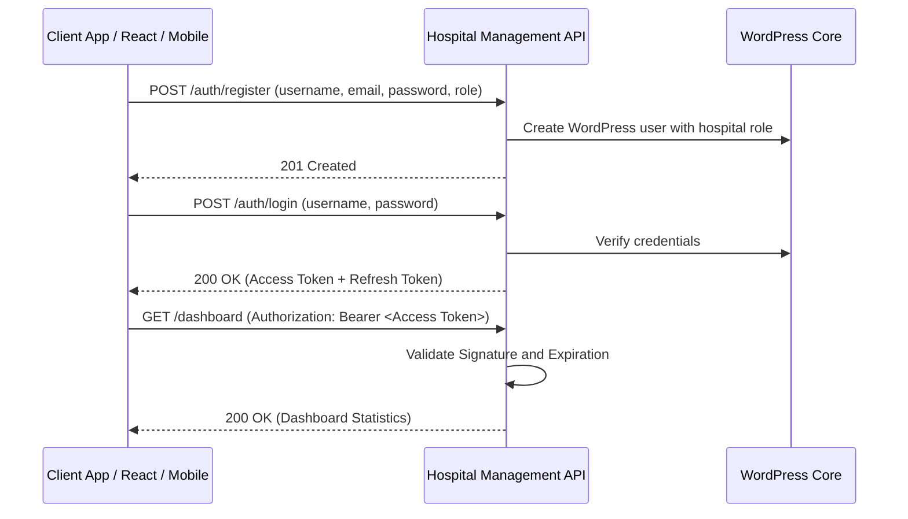

# Hospital Management API - Operations & Integration Guide

This guide provides a comprehensive overview of the **Hospital ERP API** WordPress plugin, including its architectural design, role-based access control, test credentials, and client endpoints workflow.

---

## 1. Plugin Contents & Modules

The plugin exposes a WordPress REST API under the `/wp-json/hospital-management/v1` namespace.

| Module | Core Functionality | Database Table |
| :--- | :--- | :--- |
| **Authentication** | JWT secure token registration, login, logout, and token rotation. | Standard `wp_users` & `wp_usermeta` |
| **Patients** | Register demographics, mobile, blood group, emergency contacts, and insurance. | `wp_hospital_patients` |
| **Doctors** | Directory of physicians, qualifications, schedules, and consultation fees. | `wp_hospital_doctors` |
| **Appointments** | Book schedules with status tracking (`Scheduled`, `Completed`, `Cancelled`, `No Show`). | `wp_hospital_appointments` |
| **OPD Visits** | Log outpatient check-ups, symptoms, diagnoses, and outpatient bills. | `wp_hospital_opd` |
| **IPD Admissions** | Track bed allocations, room/ward classifications, and discharges. | `wp_hospital_ipd` |
| **Prescriptions** | Issue medication lists, dosage times, durations, and instructions. | `wp_hospital_prescriptions` |
| **Billing & Invoices** | Invoice management compiling consult, room, lab, and pharmacy charges. | `wp_hospital_billing` |
| **Pharmacy** | Manage drug inventory, batch numbers, manufacturer logs, and expiry dates. | `wp_hospital_pharmacy` |
| **Lab Tests Catalog** | Define standard tests, pricing scales, and diagnostic instructions. | `wp_hospital_lab_tests` |
| **Lab Reports** | Record pathology/radiology test results and link report file downloads. | `wp_hospital_lab_reports` |
| **Doctor Schedules** | Set up weekly shifts, availability statuses, and leave tracking. | `wp_hospital_schedules` |
| **Documents** | Maintain uploads such as clinical scans, ID proofs, and medical records. | `wp_hospital_documents` |
| **Audit Logs** | Audit Trail recording administrative logins, edits, and network IPs. | `wp_hospital_activity_logs` |

---

## 2. Authentication & JWT Login Flow

The plugin secures REST endpoints via **JWT (JSON Web Token)** using the standard `HS256` encryption algorithm.



### Default Client Test Credentials

During plugin activation, standard mock user accounts are generated automatically for testing:

| Username | Password | Assigned Role | Capabilities / Permissions |
| :--- | :--- | :--- | :--- |
| `hospitalsuperadmin` | `123456` | `hospital_super_admin` | Full control over medical databases, roles, approvals, and bills |
| `hospital_doctor` | `doctorpass123` | `hospital_doctor` | View assigned patients, write prescriptions, and view lab reports |
| `hospital_receptionist` | `receptionistpass123` | `hospital_receptionist` | Register patients, book appointments, and generate billing invoices |
| `hospital_pharmacist` | `pharmacistpass123` | `hospital_pharmacist` | Manage pharmacy inventory, batch stocks, and check prescriptions |
| `hospital_lab_technician` | `labpass123` | `hospital_lab_technician` | Manage laboratory tests, enter results, and upload report files |
| `hospital_patient` | `patientpass123` | `hospital_patient` | Book personal appointments and view own medical history/invoices |

### User Registration OTP & Approval Flow

- **OTP Dispatch**: New user registrations require 2-step verification. Initiating registration sends a 6-digit verification code to the requested email address.
- **Approval Requirement**: All new user registrations (except `hospital_super_admin`) receive a default status of `PENDING` upon registration.
- **Login Behavior**: Pending users can successfully login and receive a JWT token, but will be intercepted by the UI and shown a message: *"Soon hospital_super_admin will approve and you will be having access of your panel."*
- **Super Admin Review Page**: Under the **User Approvals** tab, the Super Admin can review registered accounts and set their status to `APPROVED`, `HOLD`, or `BLOCKED`, or permanently `DELETE` them.

### Authentication Endpoints

#### 1. Initiate Registration (OTP Request)
* **Endpoint**: `POST /wp-json/hospital-management/v1/auth/register`
* **Request Payload**:
  ```json
  {
    "username": "doctor_clara",
    "email": "clara@hospital.erp",
    "password": "securepassword123",
    "name": "Dr. Clara Oswald",
    "role": "hospital_doctor"
  }
  ```
* **Response**: OTP code is dispatched via email and temporary registration details are stored in a WordPress transient.

#### 2. Verify OTP & Create User
* **Endpoint**: `POST /wp-json/hospital-management/v1/auth/register/verify`
* **Request Payload**:
  ```json
  {
    "email": "clara@hospital.erp",
    "otp": "928371"
  }
  ```
* **Response**: Registers user account in WordPress and sets the status to `PENDING` (needs super admin approval).

#### Log In to Retrieve Tokens
* **Endpoint**: `POST /wp-json/hospital-management/v1/auth/login`
* **Request Payload**:
  ```json
  {
    "username": "hospitalsuperadmin",
    "password": "123456"
  }
  ```
* **Response Payload**:
  ```json
  {
    "success": true,
    "message": "Authentication successful",
    "data": {
      "token": "eyJhbGciOiJIUzI1NiIsInR5cCI6IkpXVCJ9...",
      "refresh_token": "eyJhbGciOiJIUzI1NiIsInR5cCI6IkpX...",
      "user": {
        "id": 5,
        "username": "hospitalsuperadmin",
        "email": "admin@hospital.erp",
        "name": "Hospital Super Admin",
        "role": "hospital_super_admin",
        "status": "APPROVED"
      }
    }
  }
  ```

#### Refresh Expired Session
* **Endpoint**: `POST /wp-json/hospital-management/v1/auth/refresh-token`
* **Request Payload**:
  ```json
  {
    "refresh_token": "<refresh_token_string>"
  }
  ```

---

## 3. Role-Based Access Control Matrix (RBAC)

Endpoints enforce access criteria mapped to roles:

| Action / Capability | Super Admin | Doctor | Receptionist | Pharmacist | Lab Tech | Patient |
| :--- | :---: | :---: | :---: | :---: | :---: | :---: |
| **Manage Users & Settings** | Yes | No | No | No | No | No |
| **CRUD Doctors & Schedules** | Yes | No | No | No | No | No |
| **Manage Patient Registries** | Yes | Yes | Yes | No | No | No |
| **CRUD Appointments** | Yes | Yes | Yes | No | No | Yes |
| **OPD & IPD Medical Diagnoses**| Yes | Yes | No | No | No | No |
| **Prescriptions Authoring** | Yes | Yes | No | No | No | No |
| **Billing & Invoices Generation**| Yes | No | Yes | No | No | No |
| **Pharmacy Stock & Inventories**| Yes | No | No | Yes | No | No |
| **Laboratory Test Catalog** | Yes | No | No | No | Yes | No |
| **Upload Lab Reports** | Yes | No | No | No | Yes | No |
| **View Details / Dashboards** | Yes | Yes | Yes | Yes | Yes | Yes |
| **View Personal Medical History**| Yes | Yes | Yes | Yes | Yes | Yes (Own) |

*Protected requests require including the retrieved JWT string in the headers:*
```http
Authorization: Bearer <your_jwt_token>
```

---

## 4. Swagger UI Documentation

Access the interactive visual Swagger UI playground to execute mock requests and inspect response schemas:
* **Playground URL**: `https://rpsdigitalworld.store/hospital-management-api-docs/`

---

## 5. Modern Operations Dashboard

The plugin serves a modern dashboard for live clinic/hospital management:
* **Dashboard URL**: `https://rpsdigitalworld.store/hospital-management/`
* **Features**: Displays active patients count, today's schedules, doctor availability states, pending bills tracker, and animated metrics trends representing checkup counts and financial logs.
