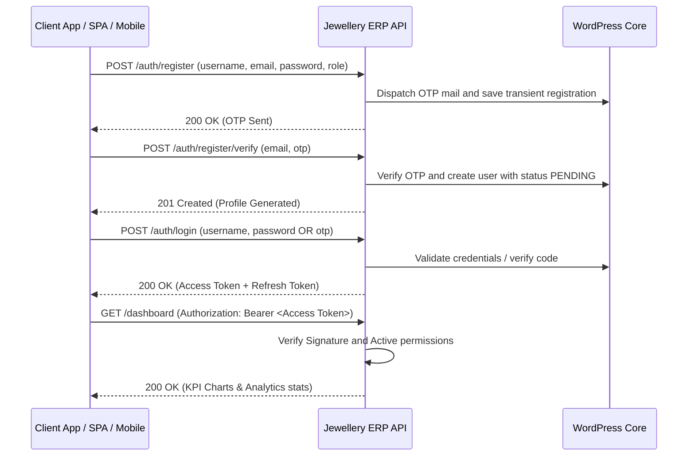

# Jewellery ERP API - Operations & Integration Guide

This guide provides a comprehensive overview of the **Jewellery ERP API** WordPress plugin, including its architectural design, database tables, role-based access control (RBAC), test credentials, and client endpoints workflow.

---

## 1. Plugin Contents & Modules

The plugin exposes a WordPress REST API under the `/wp-json/jewellery-management/v1` namespace.

| Module | Core Functionality | Database Table |
| :--- | :--- | :--- |
| **Authentication** | Secure JWT tokens, register OTPs, login, logout, and token rotation. | Standard `wp_users` & `wp_usermeta` |
| **Finished Inventory** | Finished ornaments tracking gross, net, stone weights, hallmark numbers, make charges, metal types, and prices. | `wp_jewel_inventory` |
| **Bullion Raw Stock** | Gold, silver, and platinum bullion raw material inventories tracking purity, weight, rate per gram, location, and total value. | `wp_jewel_metal_stock` |
| **Customers** | Customer registries tracking name, mobile, Aadhaar, PAN, and loyalty points. | `wp_jewel_customers` |
| **Sales Billing & GST** | Sales billing and invoices records logging weights, gold/silver rates, GST (3%), discounts, and payment methods. | `wp_jewel_billing` |
| **Karigar Register** | Craftsmen (Karigar) list tracking contact details, specialization (gold work, silver, diamond setting), and wage rates. | `wp_jewel_karigars` |
| **Job Work Allocations** | Workshop assignments sent to karigars tracking expected completions, weights allocated, and labor charges. | `wp_jewel_job_work` |
| **Repairs Intake** | Customer repair orders logging received weights, issues description, costs, and expected delivery statuses. | `wp_jewel_repairs` |
| **Custom Order Bookings** | Custom bookings tracking design reference attachments, advance amounts, and purity requirements. | `wp_jewel_custom_orders` |
| **Buybacks & Exchanges** | Old gold/silver exchange calculations payouts value. | `wp_jewel_buyback` |
| **Diamond Index** | Diamond inventory tracking shapes, carats, clarities, colors, certificate numbers, and cost. | `wp_jewel_diamonds` |
| **Store Expenses** | Store expenses (rent, salaries, marketing, electricity). | `wp_jewel_expenses` |
| **Customer Loyalty** | Customer points logs (Silver, Gold, Platinum memberships). | `wp_jewel_loyalty` |
| **Inventory Audits** | Stock variance checker records logging physical vs. system counts. | `wp_jewel_inventory_audit` |
| **Activity Logs** | Administrative actions audit log. | `wp_jewel_activity_logs` |

---

## 2. Authentication & JWT Login Flow

The plugin secures REST endpoints via **JWT (JSON Web Token)** using the standard `HS256` encryption algorithm.



### Default Client Test Credentials

During plugin activation, standard mock user accounts are generated automatically for testing:

| Username | Password | Assigned Role | Capabilities / Permissions |
| :--- | :--- | :--- | :--- |
| `jewelsuperadmin` | `123456` | `jewel_super_admin` | Full control over settings, users, approvals, and financials. |
| `jwl_manager` | `managerpass123` | `jewel_store_manager` | Manage finished ornaments, bullion, karigars, and reports. |
| `jwl_sales` | `salespass123` | `jewel_sales_executive` | Manage billing, customer repair orders, and custom orders. |
| `jwl_supervisor` | `supervisorpass123` | `jewel_karigar_supervisor` | Manage karigars and workshop job orders. |
| `jwl_accountant` | `accountpass123` | `jewel_accountant` | Manage billing invoices and profit-loss reports. |

### User Registration OTP & Approval Flow

- **OTP Dispatch**: New operator profiles require email verification. Initiating registration triggers a 6-digit OTP code to the requested email address.
- **Approval Requirement**: All new operator registrations receive a status of `PENDING` upon registration.
- **Login Behavior**: Pending operators can log in and retrieve tokens, but the SPA dashboard will intercept them with a status hold alert.
- **Super Admin Review Page**: Under the **Diagnostics & Users** tab, the Super Admin can review accounts and toggle statuses between `APPROVED`, `HOLD`, and `BLOCKED`, or permanently delete profiles.

### Authentication Endpoints

#### 1. Initiate Registration (OTP Request)
* **Endpoint**: `POST /wp-json/jewellery-management/v1/auth/register`
* **Request Payload**:
  ```json
  {
    "username": "sales_john",
    "email": "john@jwl.erp",
    "name": "John Sales",
    "role": "jewel_sales_executive"
  }
  ```
* **Response**: OTP verification mail is dispatched and temporary registration is stored.

#### 2. Verify OTP & Create User
* **Endpoint**: `POST /wp-json/jewellery-management/v1/auth/register/verify`
* **Request Payload**:
  ```json
  {
    "email": "john@jwl.erp",
    "otp": "123456"
  }
  ```
* **Response**: Activates the profile inside the WordPress users table with `PENDING` status.

#### 3. Log In to Retrieve Tokens
* **Endpoint**: `POST /wp-json/jewellery-management/v1/auth/login`
* **Request Payload**:
  ```json
  {
    "username": "jewelsuperadmin",
    "password": "123456"
  }
  ```
* **Response Payload**:
  ```json
  {
    "success": true,
    "message": "Authentication successful",
    "data": {
      "token": "eyJhbGciOiJIUzI1NiIsInR5cCI6IkpXVCJ9...",
      "refresh_token": "eyJhbGciOiJIUzI1NiIsInR5cCI6IkpX...",
      "user": {
        "id": 20,
        "username": "jewelsuperadmin",
        "email": "jeweladmin@jewel.erp",
        "name": "Jewel Super Admin",
        "role": "jewel_super_admin",
        "status": "APPROVED"
      }
    }
  }
  ```

#### 4. Refresh Session
* **Endpoint**: `POST /wp-json/jewellery-management/v1/auth/refresh-token`
* **Request Payload**:
  ```json
  {
    "refresh_token": "<refresh_token_string>"
  }
  ```

---

## 3. Role-Based Access Control Matrix (RBAC)

Endpoints enforce capability requirements mapped to roles:

| Action / Capability | Super Admin | Store Mgr | Sales Exec | Karigar Supervisor | Accountant |
| :--- | :---: | :---: | :---: | :---: | :---: |
| **Manage Users & SMTP Setup** | Yes | No | No | No | No |
| **View Dashboard Stats** | Yes | Yes | Yes | Yes | Yes |
| **Manage Ornaments & Bullion**| Yes | Yes | No | No | No |
| **Manage Billing & Exchanges** | Yes | Yes | Yes | No | Yes |
| **Manage Karigar Jobs** | Yes | Yes | No | Yes | No |
| **Manage Repairs & Bookings** | Yes | No | Yes | Yes | No |
| **View Financial Reports** | Yes | Yes | No | No | Yes |

*Protected REST requests require including the retrieved JWT Bearer string in the headers:*
```http
Authorization: Bearer <your_jwt_token>
```

---

## 4. Interactive API Playground Sandbox Docs

Access the interactive visual Swagger UI docs playground to execute mock requests and inspect response schemas:
* **Playground URL**: `/jewellery-management-api-docs/`

---

## 5. Modern Operations Dashboard

The plugin serves a modern premium dark-themed single page dashboard for operations:
* **Dashboard URL**: `/jewellery-management/`
* **Features**: Live gold/silver rates tracker, invoicing terminal (with 3% GST computation and customer loyalty reward loops), raw bullion stock vaults weight metrics, Karigar work allocation dispatches, repair intake logs, exchange buyback valuation ledger, diamond carat shape indicators, physical audit count reconciliation logs, user approvals grids, and remote SMTP settings diagnostics.
