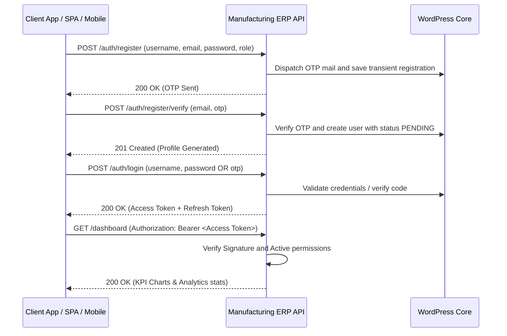

# Manufacturing ERP API - Operations & Integration Guide

This guide provides a comprehensive overview of the **Manufacturing ERP API** WordPress plugin, including its architectural design, database tables, role-based access control (RBAC), test credentials, and client endpoints workflow.

---

## 1. Plugin Contents & Modules

The plugin exposes a WordPress REST API under the `/wp-json/manufacturing-management/v1` namespace.

| Module | Core Functionality | Database Table |
| :--- | :--- | :--- |
| **Authentication** | Secure JWT tokens, register OTPs, login, logout, and token rotation. | Standard `wp_users` & `wp_usermeta` |
| **Raw Materials** | Raw input stock catalog (material name, code, safety limits, initial/current stocks). | `wp_mfg_raw_materials` |
| **Suppliers** | Vendor directory tracking company mobile, email, GSTIN, and ratings. | `wp_mfg_suppliers` |
| **Purchases** | Restocking PO purchases logging raw items, quantities, and cost values. | `wp_mfg_purchases` |
| **BOM Formula** | Bill of Materials mapping raw inputs quantities per finished product. | `wp_mfg_bom` |
| **Production Planning** | Schedule targets for finished goods quantities, priority flags, start/end dates. | `wp_mfg_production_plans` |
| **Work Orders** | Manufacturing jobs assigned to operators (Pending, In Progress, Completed, Cancelled). | `wp_mfg_work_orders` |
| **Job Work** | Outsourced manufacturing records tracking vendor, job rates, and expected returns. | `wp_mfg_job_work` |
| **Production Logs** | Machine production runs detailing operator, machines capacity, costs, and outputs. | `wp_mfg_production` |
| **Finished Goods** | Manufactured goods inventory catalogs tracking storage locations and prices. | `wp_mfg_finished_goods` |
| **Inventory Logs** | Stock movement transaction logs tracking raw inputs and finished goods. | `wp_mfg_inventory` |
| **Quality Control** | Inspections logs capturing approved vs. rejected quantities with defect notes. | `wp_mfg_quality` |
| **Logistics Dispatch** | Shipments records tracking driver name, vehicle number, and dispatch status. | `wp_mfg_dispatch` |
| **Warehouses** | Multiple storage sites directories. | `wp_mfg_warehouses` |
| **Machines** | Factory machinery inventory tracking maintenance due schedules. | `wp_mfg_machines` |
| **Audit Logs** | System activity tracker logging admin actions, logins, and IP addresses. | `wp_mfg_activity_logs` |

---

## 2. Authentication & JWT Login Flow

The plugin secures REST endpoints via **JWT (JSON Web Token)** using the standard `HS256` encryption algorithm.



### Default Client Test Credentials

During plugin activation, standard mock user accounts are generated automatically for testing:

| Username | Password | Assigned Role | Capabilities / Permissions |
| :--- | :--- | :--- | :--- |
| `mfgsuperadmin` | `123456` | `mfg_super_admin` | Full control over settings, users, approvals, and financials. |
| `mfg_production` | `productionpass123` | `mfg_production_manager` | Manage plans, BOM formulations, work orders, job work, and quality. |
| `mfg_purchase` | `purchasepass123` | `mfg_purchase_manager` | Manage B2B suppliers catalog, purchases, and PO restocking. |
| `mfg_store` | `storepass123` | `mfg_store_manager` | Access stock adjustments, warehouse sites, and stock summaries. |
| `mfg_quality` | `qualitypass123` | `mfg_quality_inspector` | Inspect work orders output, approve/reject volumes, log defect notes. |
| `mfg_dispatch` | `dispatchpass123` | `mfg_dispatch_manager` | Access dispatch logs, vehicle dispatches, and delivery dispatches. |

### User Registration OTP & Approval Flow

- **OTP Dispatch**: New operator profiles require email verification. Initiating registration triggers a 6-digit OTP code to the requested email address.
- **Approval Requirement**: All new operator registrations receive a status of `PENDING` upon registration.
- **Login Behavior**: Pending operators can log in and retrieve tokens, but the SPA dashboard will intercept them with a notice: *"Soon mfg_super_admin will approve and you will be having access of your panel."*
- **Super Admin Review Page**: Under the **Diagnostics & Users** tab, the Super Admin can review accounts and toggle statuses between `APPROVED`, `HOLD`, and `BLOCKED`, or permanently delete profiles.

### Authentication Endpoints

#### 1. Initiate Registration (OTP Request)
* **Endpoint**: `POST /wp-json/manufacturing-management/v1/auth/register`
* **Request Payload**:
  ```json
  {
    "username": "operator_sam",
    "email": "sam@mfg.erp",
    "password": "securepassword123",
    "name": "Sam Operator",
    "role": "mfg_store_manager"
  }
  ```
* **Response**: OTP verification mail is dispatched and temporary registration is stored.

#### 2. Verify OTP & Create User
* **Endpoint**: `POST /wp-json/manufacturing-management/v1/auth/register/verify`
* **Request Payload**:
  ```json
  {
    "email": "sam@mfg.erp",
    "otp": "123456"
  }
  ```
* **Response**: Activates the profile inside the WordPress users table with `PENDING` status.

#### 3. Log In to Retrieve Tokens
* **Endpoint**: `POST /wp-json/manufacturing-management/v1/auth/login`
* **Request Payload**:
  ```json
  {
    "username": "mfgsuperadmin",
    "password": "123456"
  }
  ```
* **Response Payload**:
  ```json
  {
    "success": true,
    "message": "Authentication successful",
    "data": {
      "access_token": "eyJhbGciOiJIUzI1NiIsInR5cCI6IkpXVCJ9...",
      "refresh_token": "eyJhbGciOiJIUzI1NiIsInR5cCI6IkpX...",
      "user": {
        "id": 20,
        "username": "mfgsuperadmin",
        "email": "mfgadmin@mfg.erp",
        "name": "Mfg Super Admin",
        "role": "mfg_super_admin",
        "status": "APPROVED"
      }
    }
  }
  ```

#### 4. Refresh Session
* **Endpoint**: `POST /wp-json/manufacturing-management/v1/auth/refresh-token`
* **Request Payload**:
  ```json
  {
    "refresh_token": "<refresh_token_string>"
  }
  ```

---

## 3. Role-Based Access Control Matrix (RBAC)

Endpoints enforce capability requirements mapped to roles:

| Action / Capability | Super Admin | Production Mgr | Purchase Mgr | Store Mgr | Quality Inspector | Dispatch Mgr |
| :--- | :---: | :---: | :---: | :---: | :---: | :---: |
| **Manage Users & Settings** | Yes | No | No | No | No | No |
| **View Reports & Dashboard** | Yes | Yes | No | No | No | No |
| **Manage BOM & Schedules** | Yes | Yes | No | No | No | No |
| **Register Work Orders** | Yes | Yes | No | No | No | No |
| **Log Machine Production** | Yes | Yes | No | No | No | No |
| **Outsource Job Work** | Yes | Yes | No | No | No | No |
| **Manage Suppliers & POs** | Yes | No | Yes | No | No | No |
| **Manage Warehouses & Stocks** | Yes | No | No | Yes | No | No |
| **Submit Quality Inspections**| Yes | No | No | No | Yes | No |
| **Book Logistics Dispatches** | Yes | No | No | No | No | Yes |

*Protected REST requests require including the retrieved JWT Bearer string in the headers:*
```http
Authorization: Bearer <your_jwt_token>
```

---

## 4. Swagger UI Documentation

Access the interactive visual Swagger UI docs playground to execute mock requests and inspect response schemas:
* **Playground URL**: `/manufacturing-management-api-docs/`

---

## 5. Modern Operations Dashboard

The plugin serves a modern premium dark-themed single page dashboard for operations:
* **Dashboard URL**: `/manufacturing-management/`
* **Features**: BOM formulations builder, production scheduler trends, vendor restocking purchases logs, job outsourcing dispatches, quality inspections log checklist, shipments log dispatches, and diagnostic mail settings.
