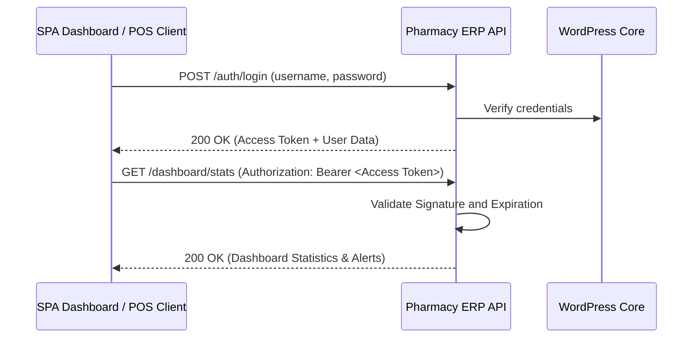

# Pharmacy ERP API - Operations & Integration Guide

This guide provides a comprehensive overview of the **Pharmacy Management API** WordPress plugin, including its architectural design, role-based access control, test credentials, and client endpoints workflow.

---

## 1. Plugin Contents & Modules

The plugin exposes a WordPress REST API under the `/wp-json/pharmacy/v1` namespace.

| Module | Core Functionality | Database Table |
| :--- | :--- | :--- |
| **Authentication** | JWT secure token registration, login, logout, and token rotation. | Standard `wp_users` & `wp_usermeta` |
| **Medicines** | Master catalog of medicines, GST rates, HSN codes, and Reorder Levels. | `wp_pharmacy_medicines` |
| **Batches & Stock** | Manage medicine stock, track manufacturing/expiry dates, and dynamic available quantities. | `wp_pharmacy_batches` |
| **Categories** | Categorize medicines into logical groups (e.g., Tablets, Syrups, Injections). | `wp_pharmacy_categories` |
| **Suppliers** | Manage wholesale distributors and medical agencies with contact info & GSTIN. | `wp_pharmacy_suppliers` |
| **Purchases** | Process inward supply from suppliers and automatically create/update stock batches upon receiving. | `wp_pharmacy_purchases`, `_purchase_items` |
| **Billing (POS)** | Generate walk-in customer invoices, apply discounts, calculate GST, and instantly deduct sold batch stock. | `wp_pharmacy_bills`, `_bill_items` |
| **Dashboard** | View real-time KPIs, Today's Revenue, 30-Day Expiry Alerts, and Low Stock Warnings. | N/A |
| **Activity Logs** | Track critical system operations, such as login and logout. | `wp_pharmacy_activity_logs` |

---

## 2. Authentication & JWT Login Flow

The plugin secures REST endpoints via **JWT (JSON Web Token)** using the standard `HS256` encryption algorithm.



### Default Client Test Credentials

During plugin activation, standard mock user accounts are generated automatically for testing:

| Username | Password | Assigned Role | Capabilities / Permissions |
| :--- | :--- | :--- | :--- |
| `pharmadmin` | `123456` | `pharmacy_admin` | Full control over settings, suppliers, purchases, medicines, and billing. |
| `pharmastaff` | `123456` | `pharmacy_staff` | Create bills, view stock, check expiry alerts, and search medicines. |

### Authentication Endpoints

#### Log In to Retrieve Tokens
* **Endpoint**: `POST /wp-json/pharmacy/v1/auth/login`
* **Request Payload**:
  ```json
  {
    "username": "pharmadmin",
    "password": "123456"
  }
  ```
* **Response Payload**:
  ```json
  {
    "success": true,
    "message": "Login successful.",
    "data": {
      "token": "eyJhbGciOiJIUzI1NiIsInR5cCI6IkpXVCJ9...",
      "user": {
        "id": 1,
        "username": "pharmadmin",
        "email": "admin@pharmacy.local",
        "name": "Pharmacy Admin",
        "role": "pharmacy_admin",
        "status": "APPROVED"
      }
    }
  }
  ```

#### Get Current User Profile
* **Endpoint**: `GET /wp-json/pharmacy/v1/auth/me`
* **Headers**: `Authorization: Bearer <token>`
* **Response**: Returns the currently authenticated user details.

---

## 3. Role-Based Access Control Matrix (RBAC)

Endpoints enforce access criteria mapped to roles. (*Note: The API is currently set to require authentication for core actions, with role expansions available based on custom implementations.*)

| Action / Capability | Pharmacy Admin | Pharmacy Staff |
| :--- | :---: | :---: |
| **Manage Users & Settings (SMTP)** | Yes | No |
| **Create/Edit Medicines & Categories** | Yes | No |
| **Manage Suppliers & Purchase Orders** | Yes | No |
| **Add/Edit Stock Batches manually** | Yes | No |
| **Generate POS Bills & Receipts** | Yes | Yes |
| **View Low Stock & Expiry Alerts** | Yes | Yes |

*Protected requests require including the retrieved JWT string in the headers:*
```http
Authorization: Bearer <your_jwt_token>
```

---

## 4. Swagger UI Documentation

Access the interactive visual Swagger UI playground to execute mock requests and inspect response schemas:
* **Playground URL**: `/pharmacy-erp-docs/`
*(Note: Use your actual domain prefix, e.g., `https://yoursite.com/pharmacy-erp-docs/`)*

---

## 5. Modern Operations Dashboard (Light Theme SPA)

The plugin serves a modern, fully-decoupled Single Page Application dashboard for live pharmacy operations:
* **Dashboard URL**: `/pharmacy-erp/`
*(Note: Use your actual domain prefix, e.g., `https://yoursite.com/pharmacy-erp/`)*
* **WordPress Admin Shortcut**: A convenient shortcut link is placed directly in your `wp-admin` sidebar (Pharmacy ERP) for 1-click access.
* **Features**: Displays active medicines, expiring stock alerts (30-day lookahead), daily revenue performance, dynamic POS billing with instant batch stock deduction, and purchase order tracking. The dashboard features a premium Light Theme aesthetic utilizing sky-blue and emerald accents.
