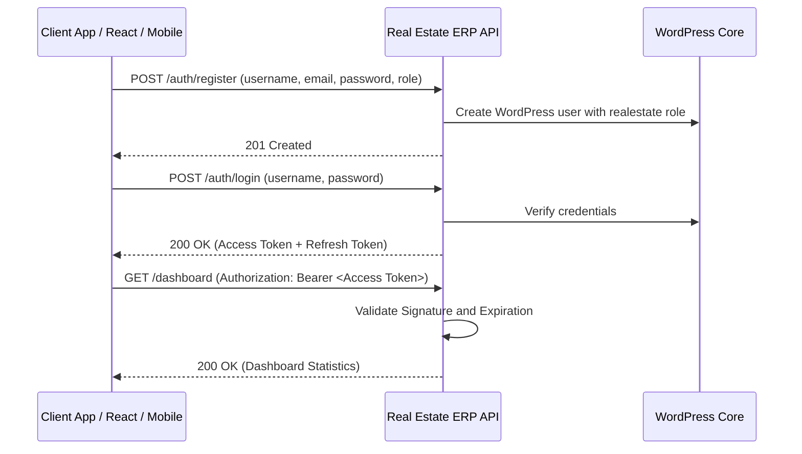

# Real Estate CRM + ERP API - Operations & Integration Guide

This guide provides a comprehensive overview of the **Real Estate CRM ERP API** WordPress plugin, including its architectural design, role-based access control, test credentials, and client endpoints workflow.

---

## 1. Plugin Contents & Modules

The plugin exposes a WordPress REST API under the `/wp-json/real-estate-management/v1` namespace.

| Module | Core Functionality | Database Table |
| :--- | :--- | :--- |
| **Authentication** | JWT secure token registration, login, logout, and token rotation. | Standard `wp_users` & `wp_usermeta` |
| **Projects** | Manage real estate projects, builders, location, and dates. | `wp_realestate_projects` |
| **Properties** | List unit inventory (apartments, villas, plots) with pricing and status. | `wp_realestate_properties` |
| **Leads** | Lead intake tracking budgets, interest types, cities, and statuses. | `wp_realestate_leads` |
| **Site Visits** | Schedule and record client visits with sales executives and transport needs. | `wp_realestate_site_visits` |
| **Customers** | Registered customers catalog mapping PAN and Aadhaar KYC cards. | `wp_realestate_customers` |
| **Bookings** | Log finalized purchases, values, discounts, and broker references. | `wp_realestate_bookings` |
| **Payment Schedules** | Spawn installment payment timelines and track paid/outstanding values. | `wp_realestate_payment_schedules` |
| **Brokers** | Channel partners registry with RERA certifications and commission rates. | `wp_realestate_brokers` |
| **Commissions** | Calculate, approve, and settle channel partner broker earnings. | `wp_realestate_commissions` |
| **Documents** | KYCs, sale agreements, and property booklets file registry. | `wp_realestate_documents` |
| **Pipeline** | Sales pipeline stages (Lead, Qualified, Site Visit, Negotiation, Booking). | `wp_realestate_pipeline` |
| **Registrations** | Track legal property registrations and final property handovers. | `wp_realestate_registrations` |
| **Audit Logs** | Security activity logs trace actions, user IDs, and client IP addresses. | `wp_realestate_activity_logs` |

---

## 2. Authentication & JWT Login Flow

The plugin secures REST endpoints via **JWT (JSON Web Token)** using the standard `HS256` encryption algorithm.



### Default Client Test Credentials

During plugin activation, standard mock user accounts are generated automatically for testing:

| Username | Password | Assigned Role | Capabilities / Permissions |
| :--- | :--- | :--- | :--- |
| `resuperadmin` | `123456` | `realestate_super_admin` | Full control over settings, users, inventory, approvals, and reports costing |
| `remanager` | `123456` | `realestate_sales_manager` | Manage incoming leads, track bookings, approve broker commissions, and view reports |
| `reexecutive` | `123456` | `realestate_sales_executive` | Capture leads, schedule site visits, log feedback, and update customer metadata |
| `rebroker` | `123456` | `realestate_broker` | Refer leads, track bookings, and view assigned commission logs |
| `reaccount` | `123456` | `realestate_accountant` | Record installment collections, pay broker commissions, and view profit/loss reports |

### User Registration OTP & Approval Flow

- **OTP Dispatch**: New user registrations require 2-step verification. Initiating registration sends a 6-digit verification code to the requested email address.
- **Approval Requirement**: All new user registrations (except `realestate_super_admin`) receive a default status of `PENDING` upon registration.
- **Login Behavior**: Pending users can successfully login and receive a JWT token, but will be intercepted by the UI and shown a message: *"Soon realestate_super_admin will approve and you will be having access of your panel."*
- **Super Admin Review Page**: Under the **User Approvals** tab, the Super Admin can review registered accounts and set their status to `APPROVED`, `HOLD`, or `BLOCKED`, or permanently `DELETE` them.

### Authentication Endpoints

#### 1. Initiate Registration (OTP Request)
* **Endpoint**: `POST /wp-json/real-estate-management/v1/auth/register`
* **Request Payload**:
  ```json
  {
    "username": "executive_sharma",
    "email": "sharma@realestate.erp",
    "password": "securepassword123",
    "name": "Sharma Kumar",
    "role": "realestate_sales_executive"
  }
  ```
* **Response**: OTP code is dispatched via email and temporary registration details are stored in a WordPress transient.

#### 2. Verify OTP & Create User
* **Endpoint**: `POST /wp-json/real-estate-management/v1/auth/register/verify`
* **Request Payload**:
  ```json
  {
    "email": "sharma@realestate.erp",
    "otp": "839201"
  }
  ```
* **Response**: Registers user account in WordPress and sets the status to `PENDING` (needs super admin approval).

#### 3. Log In to Retrieve Tokens
* **Endpoint**: `POST /wp-json/real-estate-management/v1/auth/login`
* **Request Payload**:
  ```json
  {
    "username": "resuperadmin",
    "password": "123456"
  }
  ```
* **Response Payload**:
  ```json
  {
    "success": true,
    "message": "Login successful.",
    "data": {
      "token": "eyJhbGciOiJIUzI1NiIsInR5cCI6IkpXVCJ9...",
      "refresh_token": "eyJhbGciOiJIUzI1NiIsInR5cCI6IkpX...",
      "user": {
        "id": 5,
        "username": "resuperadmin",
        "email": "admin@realestate.erp",
        "name": "Real Estate Super Admin",
        "role": "realestate_super_admin",
        "status": "APPROVED"
      }
    }
  }
  ```

---

## 3. Role-Based Access Control Matrix (RBAC)

Endpoints enforce access criteria mapped to roles:

| Action / Capability | Super Admin | Sales Manager | Sales Executive | Broker | Accountant |
| :--- | :---: | :---: | :---: | :---: | :---: |
| **Manage Users & Settings** | Yes | No | No | No | No |
| **Manage Projects & Inventory** | Yes | No | No | No | No |
| **Manage CRM Leads & Pipeline** | Yes | Yes | Yes | No | No |
| **Schedule Site Visits & Cabs** | Yes | No | Yes | No | No |
| **Record Property Bookings** | Yes | Yes | No | No | No |
| **Manage Payment Schedules** | Yes | No | No | No | Yes |
| **Manage Broker Settlements** | Yes | Yes | No | No | Yes |
| **View Financial Reports** | Yes | Yes | No | No | Yes |
| **View Dashboard Analytics** | Yes | Yes | Yes | No | Yes |

*Protected requests require including the retrieved JWT string in the headers:*
```http
Authorization: Bearer <your_jwt_token>
```

---

## 4. Swagger UI Documentation

Access the interactive visual Swagger UI playground to execute mock requests and inspect response schemas:
* **Playground URL**: `/real-estate-management-api-docs/`

---

## 5. Modern Operations Dashboard

The plugin serves a modern dashboard for live Real Estate site management:
* **Dashboard URL**: `/real-estate-management/`
* **Features**: Displays active properties inventory status, leads lists, site visits logs, payment timelines, and animated bar charts representing revenue collection trends.
