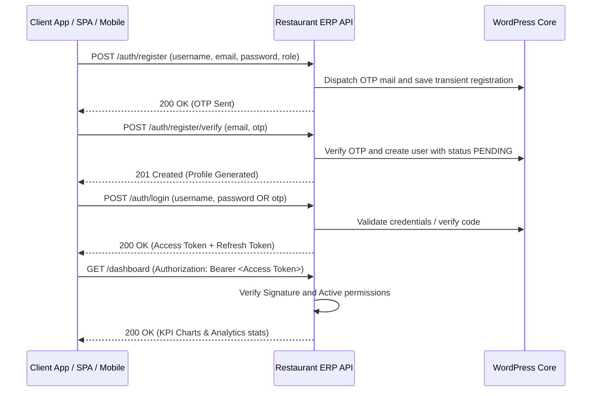

# Restaurant ERP API - Operations & Integration Guide

This guide provides a comprehensive overview of the **Restaurant ERP API** WordPress plugin, including its architectural design, database tables, role-based access control (RBAC), test credentials, and client endpoints workflow.

---

## 1. Plugin Contents & Modules

The plugin exposes a WordPress REST API under the `/wp-json/restaurant-management/v1` namespace.

| Module | Core Functionality | Database Table |
| :--- | :--- | :--- |
| **Authentication** | Secure JWT tokens, register OTPs, login, logout, and token rotation. | Standard `wp_users` & `wp_usermeta` |
| **Tables** | Floor maps coordinate trackers mapping Table capacity & status (Available, Occupied, Reserved, Cleaning). | `wp_restaurant_tables` |
| **Categories** | F&B taxonomy categories (Starters, Mains, Desserts, Beverages). | `wp_restaurant_categories` |
| **Menu Catalog** | Dishes catalog with item codes, prices, cost, tax percentage, prep time, and image. | `wp_restaurant_menu` |
| **Orders** | Dine-in, Takeaway, and Online order header transactions (Pending, Preparing, Ready, Served, Completed, Cancelled). | `wp_restaurant_orders` |
| **Order Items** | Order items lines capturing dish references, quantities, and prep notes. | `wp_restaurant_order_items` |
| **Invoices** | Billing invoices recording payment modes (Cash, Card, UPI), taxes (CGST/SGST), and loyalty point deductions. | `wp_restaurant_invoices` |
| **Customers** | CRM profiles managing customer details, lifetime spends, and loyalty point levels. | `wp_restaurant_customers` |
| **Ingredients** | Raw inventory stock level indicators (Current balances, Minimum limits, Unit costs). | `wp_restaurant_ingredients` |
| **Recipe Formulation** | Formulations listing quantity of raw ingredients required per menu item to trigger automatic stock deductions. | `wp_restaurant_recipes` |
| **Suppliers** | B2B raw materials vendor registries. | `wp_restaurant_suppliers` |
| **Purchases** | Restocking PO logs tracking supplier bills and purchase items. | `wp_restaurant_purchases` |
| **Deliveries** | Home-delivery order tracking logs (Assigned, Picked Up, Out for Delivery, Delivered). | `wp_restaurant_deliveries` |
| **Branches** | Multi-unit branch code index tables. | `wp_restaurant_branches` |
| **Staff & Shifts** | Employee registers tracking shifts, overtime, salaries, and attendance status. | `wp_restaurant_staff` |
| **Expenses** | Operating expense vouchers (Rent, Electricity, Gas, Salaries, etc.). | `wp_restaurant_expenses` |
| **Audit Logs** | Audit records tracking system admin updates, OTP validations, and IP addresses. | `wp_restaurant_activity_logs` |

---

## 2. Authentication & JWT Login Flow

The plugin secures REST endpoints via **JWT (JSON Web Token)** using the standard `HS256` encryption algorithm.



### Default Client Test Credentials

During plugin activation, standard mock user accounts are generated automatically for testing:

| Username | Password | Assigned Role | Capabilities / Permissions |
| :--- | :--- | :--- | :--- |
| `restsuperadmin` | `123456` | `restaurant_super_admin` | Full control over settings, users, approvals, and financials. |
| `rest_manager` | `managerpass123` | `restaurant_manager` | Manage orders, inventory, staff, reports, and kitchen. |
| `rest_cashier` | `cashierpass123` | `restaurant_cashier` | Access billing, checkout payments, and customer records. |
| `rest_chef` | `chefpass123` | `restaurant_chef` | Access kitchen order display (KDS) and food prep statuses. |
| `rest_waiter` | `waiterpass123` | `restaurant_waiter` | Place table orders and manage table reservations. |
| `rest_delivery` | `deliverypass123` | `restaurant_delivery` | Access delivery orders and update delivery dispatches. |

### User Registration OTP & Approval Flow

- **OTP Dispatch**: New operator profiles require email verification. Initiating registration triggers a 6-digit OTP code to the requested email address.
- **Approval Requirement**: All new operator registrations receive a status of `PENDING` upon registration.
- **Login Behavior**: Pending operators can log in and retrieve tokens, but the SPA dashboard will intercept them with a notice: *"Soon restaurant_super_admin will approve and you will be having access of your panel."*
- **Super Admin Review Page**: Under the **Diagnostics & Admin** tab, the Super Admin can review accounts and toggle statuses between `APPROVED`, `HOLD`, and `BLOCKED`, or permanently delete profiles.

### Authentication Endpoints

#### 1. Initiate Registration (OTP Request)
* **Endpoint**: `POST /wp-json/restaurant-management/v1/auth/register`
* **Request Payload**:
  ```json
  {
    "username": "chef_ramesh",
    "email": "ramesh@restaurant.erp",
    "password": "securepassword123",
    "name": "Ramesh Chef",
    "role": "restaurant_chef"
  }
  ```
* **Response**: OTP verification mail is dispatched and temporary registration is stored.

#### 2. Verify OTP & Create User
* **Endpoint**: `POST /wp-json/restaurant-management/v1/auth/register/verify`
* **Request Payload**:
  ```json
  {
    "email": "ramesh@restaurant.erp",
    "otp": "123456"
  }
  ```
* **Response**: Activates the profile inside the WordPress users table with `PENDING` status.

#### 3. Log In to Retrieve Tokens
* **Endpoint**: `POST /wp-json/restaurant-management/v1/auth/login`
* **Request Payload**:
  ```json
  {
    "username": "restsuperadmin",
    "password": "123456"
  }
  ```
* **Response Payload**:
  ```json
  {
    "success": true,
    "message": "Authentication successful",
    "data": {
      "access_token": "eyJhbGciOiJIUzI1NiIsInR5cCI6IkpXVCJ9...",
      "refresh_token": "eyJhbGciOiJIUzI1NiIsInR5cCI6IkpX...",
      "user": {
        "id": 15,
        "username": "restsuperadmin",
        "email": "superadmin@restaurant.erp",
        "name": "Super Admin",
        "role": "restaurant_super_admin",
        "status": "APPROVED"
      }
    }
  }
  ```

#### 4. Refresh Session
* **Endpoint**: `POST /wp-json/restaurant-management/v1/auth/refresh-token`
* **Request Payload**:
  ```json
  {
    "refresh_token": "<refresh_token_string>"
  }
  ```

---

## 3. Role-Based Access Control Matrix (RBAC)

Endpoints enforce capability requirements mapped to roles:

| Action / Capability | Super Admin | Manager | Cashier | Chef | Waiter | Delivery |
| :--- | :---: | :---: | :---: | :---: | :---: | :---: |
| **Manage Users & Settings** | Yes | No | No | No | No | No |
| **View Reports & Dashboard** | Yes | Yes | No | No | No | No |
| **Manage Tables & Floor** | Yes | Yes | No | No | Yes | No |
| **Manage Menu Catalog** | Yes | Yes | No | No | No | No |
| **POS Billing Checkouts** | Yes | Yes | Yes | No | No | No |
| **Update KDS prep statuses**| Yes | Yes | No | Yes | No | No |
| **Manage Inventory Stocks** | Yes | Yes | No | No | No | No |
| **Supplier PO restocks** | Yes | Yes | No | No | No | No |
| **Shift Scheduling & Attendance**| Yes | Yes | No | No | No | No |
| **Record Expenses** | Yes | Yes | Yes | No | No | No |
| **Update Delivery Partner status**| Yes | Yes | No | No | No | Yes |

*Protected REST requests require including the retrieved JWT Bearer string in the headers:*
```http
Authorization: Bearer <your_jwt_token>
```

---

## 4. Swagger UI Documentation

Access the interactive visual Swagger UI docs playground to execute mock requests and inspect response schemas:
* **Playground URL**: `/restaurant-management-api-docs/`

---

## 5. Modern Operations Dashboard

The plugin serves a modern premium dark-themed single page dashboard for operations:
* **Dashboard URL**: `/restaurant-management/`
* **Features**: Dine-in orders builder, table coordinator cards, KDS preparer panels, inventory safety logs, supplier POs, delivery dispatches, employee shift manager, operating expenses ledger, and financial profitability reports.
