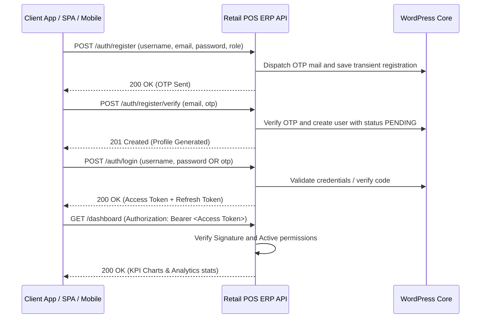

# Retail POS ERP API - Operations & Integration Guide

This guide provides a comprehensive overview of the **Retail POS ERP API** WordPress plugin, including its architectural design, role-based access control, test credentials, and client endpoints workflow.

---

## 1. Plugin Contents & Modules

The plugin exposes a WordPress REST API under the `/wp-json/retail-pos/v1` namespace.

| Module | Core Functionality | Database Table |
| :--- | :--- | :--- |
| **Authentication** | Secure JWT tokens, register OTPs, login, logout, and token rotation. | Standard `wp_users` & `wp_usermeta` |
| **Products** | Manage product listings, SKUs, barcode mappings, and vector generation. | `wp_pos_products` |
| **Categories** | Product taxonomy categories management. | `wp_pos_categories` |
| **Brands** | Manufacturers and brands registry. | `wp_pos_brands` |
| **Customers** | Keep track of demographic details, mobile, and GST numbers. | `wp_pos_customers` |
| **Suppliers** | Maintain vendor profiles and directories. | `wp_pos_suppliers` |
| **Sales Billing** | Complete checkout header listings and historical receipts record. | `wp_pos_sales` |
| **Sales Items** | Checkout lines capturing historical sales rates and GST taxes. | `wp_pos_sale_items` |
| **Purchase Orders** | Supplier restocking PO log records. | `wp_pos_purchases` |
| **Inventory Tracking** | Track available stock levels, reorder metrics, and damaged items. | `wp_pos_inventory` |
| **Expenses** | Log operational petty cash and bills (Rent, Electricity, etc.). | `wp_pos_expenses` |
| **Loyalty Program** | Accumulate customer loyalty points ledger (Earned vs Redeemed). | `wp_pos_loyalty` |
| **Multi-Branch Stores** | Location management and store code indexes. | `wp_pos_stores` |
| **File Attachments** | Document mapping logs. | `wp_pos_documents` |
| **Audit Logs** | Audit records tracks logging admin actions and IP addresses. | `wp_pos_activity_logs` |

---

## 2. Authentication & JWT Login Flow

The plugin secures REST endpoints via **JWT (JSON Web Token)** using the standard `HS256` encryption algorithm.



### Default Client Test Credentials

During plugin activation, standard mock user accounts are generated automatically for testing:

| Username | Password | Assigned Role | Capabilities / Permissions |
| :--- | :--- | :--- | :--- |
| `possuperadmin` | `123456` | `pos_super_admin` | Full control over settings, users, approvals, and financials |
| `pos_manager` | `managerpass123` | `pos_store_manager` | Manage products, inventory, sales, purchases, and view reports |
| `pos_cashier` | `cashierpass123` | `pos_cashier` | Manage billing, checkout transactions, and customers |
| `pos_inventory` | `inventorypass123` | `pos_inventory_manager` | Manage safety levels, supplier restocking, and directories |

### User Registration OTP & Approval Flow

- **OTP Dispatch**: New registrations require verification. Initiating registration triggers a 6-digit OTP code to the requested email address.
- **Approval Requirement**: All new operator registrations receive a status of `PENDING` upon registration.
- **Login Behavior**: Pending operators can successfully log in and retrieve tokens, but the SPA dashboard will intercept them with a notice: *"Soon pos_super_admin will approve and you will be having access of your panel."*
- **Super Admin Review Page**: Under the **Admin Settings** tab, the Super Admin can review accounts and toggle statuses between `APPROVED`, `HOLD`, and `BLOCKED`, or permanently delete profiles.

### Authentication Endpoints

#### 1. Initiate Registration (OTP Request)
* **Endpoint**: `POST /wp-json/retail-pos/v1/auth/register`
* **Request Payload**:
  ```json
  {
    "username": "cashier_sam",
    "email": "sam@pos.erp",
    "password": "securepassword123",
    "name": "Sam Johnson",
    "role": "pos_cashier"
  }
  ```
* **Response**: OTP verification mail is dispatched and temporary registration is stored.

#### 2. Verify OTP & Create User
* **Endpoint**: `POST /wp-json/retail-pos/v1/auth/register/verify`
* **Request Payload**:
  ```json
  {
    "email": "sam@pos.erp",
    "otp": "482910"
  }
  ```
* **Response**: Activates the profile inside the WordPress users table with `PENDING` status.

#### 3. Log In to Retrieve Tokens
* **Endpoint**: `POST /wp-json/retail-pos/v1/auth/login`
* **Request Payload**:
  ```json
  {
    "username": "possuperadmin",
    "password": "123456"
  }
  ```
* **Response Payload**:
  ```json
  {
    "success": true,
    "message": "Authentication successful",
    "data": {
      "access_token": "eyJhbGciOiJIUzI1NiIsInR5cCI6IkpXVCJ9...",
      "refresh_token": "eyJhbGciOiJIUzI1NiIsInR5cCI6IkpX...",
      "user": {
        "id": 12,
        "username": "possuperadmin",
        "email": "admin@pos.erp",
        "name": "POS Super Admin",
        "role": "pos_super_admin",
        "status": "APPROVED"
      }
    }
  }
  ```

#### 4. Refresh Session
* **Endpoint**: `POST /wp-json/retail-pos/v1/auth/refresh-token`
* **Request Payload**:
  ```json
  {
    "refresh_token": "<refresh_token_string>"
  }
  ```

---

## 3. Role-Based Access Control Matrix (RBAC)

Endpoints enforce capability requirements mapped to roles:

| Action / Capability | Super Admin | Store Manager | Cashier | Inventory Manager |
| :--- | :---: | :---: | :---: | :---: |
| **Manage Users & Settings** | Yes | No | No | No |
| **Manage Product Catalog** | Yes | Yes | No | No |
| **View Catalog Listings** | Yes | Yes | Yes | Yes |
| **Inventory stock adjustments**| Yes | Yes | No | Yes |
| **POS Billing Checkouts** | Yes | Yes | Yes | No |
| **Void Invoices / Refunds** | Yes | Yes | Yes | No |
| **Supplier PO restocks** | Yes | Yes | No | Yes |
| **Record Daily Expenses** | Yes | Yes | Yes | No |
| **Noticeboard / Dashboard KPIs** | Yes | Yes | Yes | Yes |
| **View Profit / GST Reports** | Yes | Yes | No | No |

*Protected REST requests require including the retrieved JWT Bearer string in the headers:*
```http
Authorization: Bearer <your_jwt_token>
```

---

## 4. Swagger UI Documentation

Access the interactive visual Swagger UI docs playground to execute mock requests and inspect response schemas:
* **Playground URL**: `/retail-pos-api-docs/`

---

## 5. Modern Operations Dashboard

The plugin serves a modern premium dark-themed dashboard for POS management:
* **Dashboard URL**: `/retail-pos/`
* **Features**: Live sales checkout registers, barcode scanning simulation filters, real-time KPI card trackers, Chart.js metrics graphs, stock reorder checklists, and thermal receipt print configurations.
