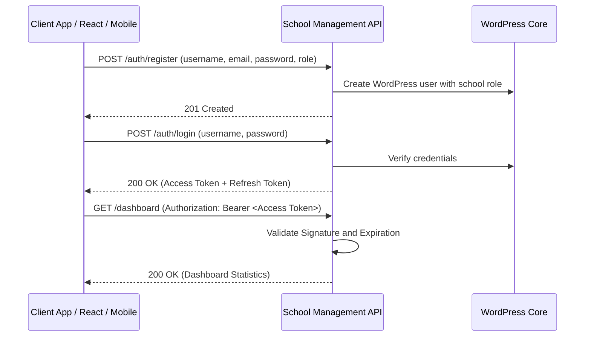

# School Management API - Operations & Integration Guide

This guide provides a comprehensive overview of the **School Management API** WordPress plugin, including its architectural design, role-based access control, test credentials, and client endpoints workflow.

---

## 1. Plugin Contents & Modules

The plugin exposes a WordPress REST API under the `/wp-json/school-management/v1` namespace.

| Module | Core Functionality | Database Table |
| :--- | :--- | :--- |
| **Authentication** | JWT secure token registration, login, logout, and token rotation. | Standard `wp_users` & `wp_usermeta` |
| **Students** | Manage admission numbers, roll records, classes, and parents links. | `wp_school_students` |
| **Parents** | Record guardian profile fields (father/mother name, occupation, mobile). | `wp_school_parents` |
| **Teachers** | Track qualifications, salaries, joining dates, and active status. | `wp_school_teachers` |
| **Academics** | Define class grades, classrooms sections, and subjects catalog. | `wp_school_classes`, `_sections`, `_subjects` |
| **Attendance** | Log student and teacher daily attendance (Present, Absent, Late, Half Day). | `wp_school_attendance` |
| **Timetable** | Map class period slots, times, subjects, and teacher allocations. | `wp_school_events` (Type: `TIMETABLE`) |
| **Homework** | Broadcast homework requirements and accept file upload submissions. | `wp_school_events` & `wp_school_documents` |
| **Exams & Marks** | Define exam dates, record grades, and calculate averages. | `wp_school_exams` & `wp_school_marks` |
| **Fees Management** | Set up annual structures and register payments collection (Razorpay ready). | `wp_school_fees` |
| **Payroll** | Generate salary records, allowances, deductions, and payslips. | `wp_school_payroll` |
| **Library** | Track library book catalogs, issue loans, and manage returns. | `wp_school_library` |
| **Transport** | Manage school bus routing, vehicles, and driver assignments. | `wp_school_transport` |
| **Notice Board** | Publish school notice announcements and public calendar events. | `wp_school_events` |
| **Documents** | Maintain identity/qualification proofs and homework sheets. | `wp_school_documents` |
| **Audit Logs** | Track administrator transactions, logging actions and IP addresses. | `wp_school_activity_logs` |

---

## 2. Authentication & JWT Login Flow

The plugin secures REST endpoints via **JWT (JSON Web Token)** using the standard `HS256` encryption algorithm.



### Default Client Test Credentials

During plugin activation, standard mock user accounts are generated automatically for testing:

| Username | Password | Assigned Role | Capabilities / Permissions |
| :--- | :--- | :--- | :--- |
| `school_admin` | `adminpass123` | `school_super_admin` | Full control over settings, users, and financials |
| `school_principal` | `principalpass123` | `school_principal` | Manage students, teachers, academics, and views |
| `school_teacher` | `teacherpass123` | `school_teacher` | Manage assigned class attendance, marks, and homework |
| `school_accountant` | `accountantpass123` | `school_accountant` | Manage fees, payroll, expenses, and invoices |
| `school_parent` | `parentpass123` | `school_parent` | View child attendance, grades, notices, and fees |
| `school_student` | `studentpass123` | `school_student` | View own attendance, grades, timetable, and homework |

### Authentication Endpoints

#### Register a Portal User
* **Endpoint**: `POST /wp-json/school-management/v1/auth/register`
* **Request Payload**:
  ```json
  {
    "username": "principal_robert",
    "email": "robert@school.erp",
    "password": "securepassword123",
    "name": "Robert Carter",
    "role": "school_principal"
  }
  ```

#### Log In to Retrieve Tokens
* **Endpoint**: `POST /wp-json/school-management/v1/auth/login`
* **Request Payload**:
  ```json
  {
    "username": "school_admin",
    "password": "adminpass123"
  }
  ```
* **Response Payload**:
  ```json
  {
    "success": true,
    "message": "Authentication successful",
    "data": {
      "token": "eyJhbGciOiJIUzI1NiIsInR5cCI6IkpXVCJ9...",
      "refresh_token": "eyJhbGciOiJIUzI1NiIsInR5cCI6IkpX...",
      "user": {
        "id": 5,
        "username": "school_admin",
        "email": "admin@school.erp",
        "name": "School Super Admin",
        "role": "school_super_admin"
      }
    }
  }
  ```

#### Refresh Expired Session
* **Endpoint**: `POST /wp-json/school-management/v1/auth/refresh-token`
* **Request Payload**:
  ```json
  {
    "refresh_token": "<refresh_token_string>"
  }
  ```

---

## 3. Role-Based Access Control Matrix (RBAC)

Endpoints enforce access criteria mapped to roles:

| Action / Capability | Super Admin | Principal | Teacher | Accountant | Parent | Student |
| :--- | :---: | :---: | :---: | :---: | :---: | :---: |
| **Manage Users & Settings** | Yes | No | No | No | No | No |
| **Manage Academics / Classes** | Yes | Yes | No | No | No | No |
| **CRUD Students & Teachers** | Yes | Yes | No | No | No | No |
| **Attendance Logging** | Yes | Yes | Yes | No | No | No |
| **Grades & Marks Entry** | Yes | No | Yes | No | No | No |
| **Fees structures & Collections**| Yes | No | No | Yes | No | No |
| **Payroll & Payslips Generation**| Yes | No | No | Yes | No | No |
| **Library catalog loans** | Yes | No | No | No | No | No |
| **Noticeboard Announcements** | Yes | Yes | No | No | No | No |
| **View Details / Dashboards** | Yes | Yes | Yes | Yes | Yes | Yes |

*Protected requests require including the retrieved JWT string in the headers:*
```http
Authorization: Bearer <your_jwt_token>
```

---

## 4. Swagger UI Documentation

Access the interactive visual Swagger UI playground to execute mock requests and inspect response schemas:
* **Playground URL**: `https://rpsdigitalworld.store/school-management-api-docs/`

---

## 5. Modern Operations Dashboard

The plugin serves a modern dashboard for live school management:
* **Dashboard URL**: `https://rpsdigitalworld.store/school-management/`
* **Features**: Displays active students/teachers indicators, monthly collection fees metrics, notices, and animated SVG charts representing registrations and tuition collections.
