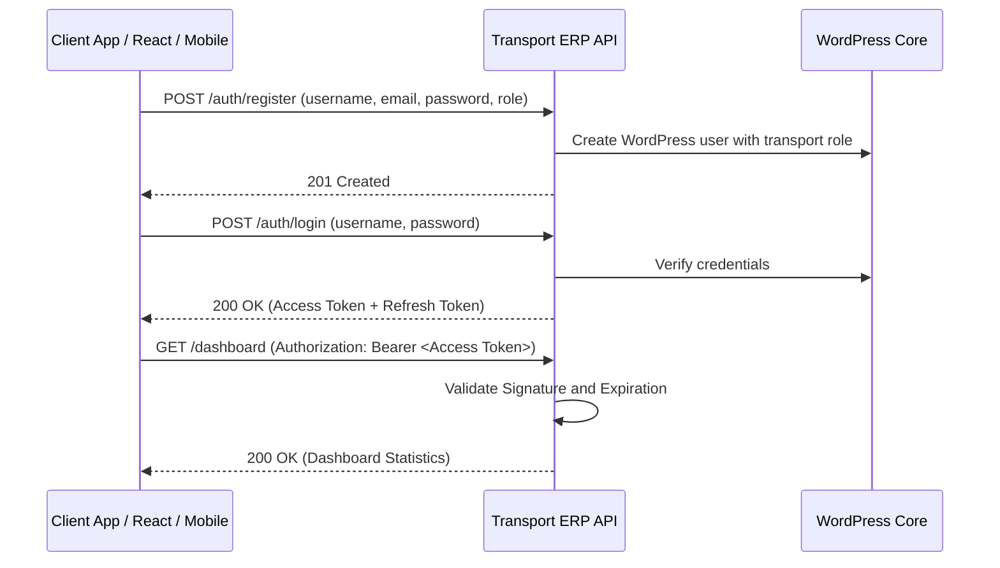

# Transport & Logistics ERP API - Operations & Integration Guide

This guide provides a comprehensive overview of the **Transport / Logistics ERP API** WordPress plugin, including its architectural design, role-based access control, test credentials, and client endpoints workflow.

---

## 1. Plugin Contents & Modules

The plugin exposes a WordPress REST API under the `/wp-json/transport-management/v1` namespace.

| Module | Core Functionality | Database Table |
| :--- | :--- | :--- |
| **Authentication** | JWT secure token registration, login, logout, and token rotation. | Standard `wp_users` & `wp_usermeta` |
| **Vehicles** | Fleet registry tracking vehicle number, model, status, and expiry schedules. | `wp_transport_vehicles` |
| **Drivers** | Driver registry tracking license details, joining date, and salary structure. | `wp_transport_drivers` |
| **Routes** | Route registry mapping sources, destinations, distances, and toll costs. | `wp_transport_routes` |
| **Trips** | Core trip scheduler allocating driver, vehicle, route, and freight value. | `wp_transport_trips` |
| **Deliveries** | GPS tracking details, delivery statuses, and Proof of Delivery (POD) uploads. | `wp_transport_deliveries` |
| **Fuel Tracking** | Record fuel refills, total costs, odometer readings, and efficiency logs. | `wp_transport_fuel` |
| **Maintenance** | Manage garage logs, repairs, oil changes, costs, and service alerts. | `wp_transport_maintenance` |
| **Driver Salaries** | Compute month-wise driver earnings based on fixed or per-trip rates. | `wp_transport_salaries` |
| **Challans** | Monitor traffic challans, fine amounts, types, and payment statuses. | `wp_transport_challans` |
| **Expenses** | Track loading/unloading fees, tolls, and miscellaneous trip costs. | `wp_transport_expenses` |
| **Customers** | Manage corporate clients/consignors with GST details. | `wp_transport_customers` |
| **Billing & Invoices**| Generate GST invoice summaries and calculate tax values per trip. | `wp_transport_billing` |
| **Documents** | Store uploaded copies of RC books, driving licenses, and delivery PODs. | `wp_transport_documents` |
| **Audit Logs** | Security logs tracing actions, user IDs, and client IP addresses. | `wp_transport_activity_logs` |

---

## 2. Authentication & JWT Login Flow

The plugin secures REST endpoints via **JWT (JSON Web Token)** using the standard `HS256` encryption algorithm.



### Default Client Test Credentials

During plugin activation, standard mock user accounts are generated automatically for testing:

| Username | Password | Assigned Role | Capabilities / Permissions |
| :--- | :--- | :--- | :--- |
| `tsuperadmin` | `123456` | `transport_super_admin` | Full control over settings, users, vehicles, routes, and billing |
| `tfleetmgr` | `123456` | `transport_fleet_manager` | Manage vehicles, trips, maintenance scheduling, and fuel tracking |
| `topsmgr` | `123456` | `transport_operations_manager` | Manage routes, delivery tracking, and live GPS map tracking |
| `tdriver1` | `123456` | `transport_driver` | View assigned trips, update delivery status, and upload POD documents |
| `taccountant` | `123456` | `transport_accountant` | Process driver salaries, trip expenses, traffic challans, and customer invoices |

### User Registration OTP & Approval Flow

- **OTP Dispatch**: New user registrations require 2-step verification. Initiating registration sends a 6-digit verification code to the requested email address.
- **Approval Requirement**: All new user registrations (except `transport_super_admin`) receive a default status of `PENDING` upon registration.
- **Login Behavior**: Pending users can successfully login and receive a JWT token, but will be intercepted by the UI and shown a message: *"Soon transport_super_admin will approve and you will be having access of your panel."*
- **Super Admin Review Page**: Under the **User Approvals** tab, the Super Admin can review registered accounts and set their status to `APPROVED`, `HOLD`, or `BLOCKED`, or permanently `DELETE` them.

### Authentication Endpoints

#### 1. Initiate Registration (OTP Request)
* **Endpoint**: `POST /wp-json/transport-management/v1/auth/register`
* **Request Payload**:
  ```json
  {
    "username": "driver_singh",
    "email": "singh@transport-erp.com",
    "password": "securepassword123",
    "name": "Singh Kumar",
    "role": "transport_driver"
  }
  ```
* **Response**: OTP code is dispatched via email and temporary registration details are stored in a WordPress transient.

#### 2. Verify OTP & Create User
* **Endpoint**: `POST /wp-json/transport-management/v1/auth/register/verify`
* **Request Payload**:
  ```json
  {
    "email": "singh@transport-erp.com",
    "otp": "123456"
  }
  ```
* **Response**: Registers user account in WordPress and sets the status to `PENDING` (needs super admin approval).

#### 3. Log In to Retrieve Tokens
* **Endpoint**: `POST /wp-json/transport-management/v1/auth/login`
* **Request Payload**:
  ```json
  {
    "username": "tsuperadmin",
    "password": "123456"
  }
  ```
* **Response Payload**:
  ```json
  {
    "success": true,
    "message": "Login successful.",
    "data": {
      "token": "eyJhbGciOiJIUzI1NiIsInR5cCI6IkpXVCJ9...",
      "refresh_token": "eyJhbGciOiJIUzI1NiIsInR5cCI6IkpX...",
      "user": {
        "id": 5,
        "username": "tsuperadmin",
        "email": "tsuperadmin@transport-erp.com",
        "name": "Transport Admin",
        "role": "transport_super_admin",
        "status": "APPROVED"
      }
    }
  }
  ```

---

## 3. Role-Based Access Control Matrix (RBAC)

Endpoints enforce access criteria mapped to roles:

| Action / Capability | Super Admin | Fleet Manager | Operations Manager | Driver | Accountant |
| :--- | :---: | :---: | :---: | :---: | :---: |
| **Manage Users & Settings** | Yes | No | No | No | No |
| **Manage Vehicles & Fleet** | Yes | Yes | No | No | No |
| **Manage Trips Allocation** | Yes | Yes | No | No | No |
| **View Assigned Trips** | Yes | Yes | No | Yes | No |
| **Update Delivery / POD** | Yes | No | Yes | Yes | No |
| **Manage Routes & Map** | Yes | No | Yes | No | No |
| **Manage Maintenance & Fuel**| Yes | Yes | No | No | No |
| **Manage Payroll / Salaries** | Yes | No | No | No | Yes |
| **Record Expenses & Tolls** | Yes | No | No | No | Yes |
| **Manage Challans & Fines** | Yes | No | No | No | Yes |
| **Generate Freight Billing** | Yes | No | No | No | Yes |
| **View Dashboard Analytics** | Yes | Yes | Yes | Yes | Yes |

*Protected requests require including the retrieved JWT string in the headers:*
```http
Authorization: Bearer <your_jwt_token>
```

---

## 4. Swagger UI Documentation

Access the interactive visual Swagger UI playground to execute mock requests and inspect response schemas:
* **Playground URL**: `/transport-management-api-docs/`

---

## 5. Modern Operations Dashboard

The plugin serves a modern dashboard for live Logistics & Fleet management:
* **Dashboard URL**: `/transport-management/`
* **Features**:
  * **Dynamic Statistics**: Active Vehicles, Active Trips, Today's Deliveries, Fuel and Maintenance Cost, Unpaid Challans, Salary Outflow, and Monthly Billing Revenue.
  * **Live GPS Simulator**: Visualize active trips pathing dynamically along an animated road grid representing real-time vehicle movement.
  * **Driver Simulator**: Upload Proof of Delivery (POD) images or PDFs and update shipment status directly from a split-screen viewport.
  * **Billing & Payroll Calculator**: Create month-wise salary payouts, log fuel refill costs, register challans, and issue PDF-ready invoice calculations with automatical GST additions.
  * **No-Flash Reload Security**: Embedded page-level script checking local storage tokens instantly before page rendering, eliminating layout shifting or visual flash of unauthenticated screens.
