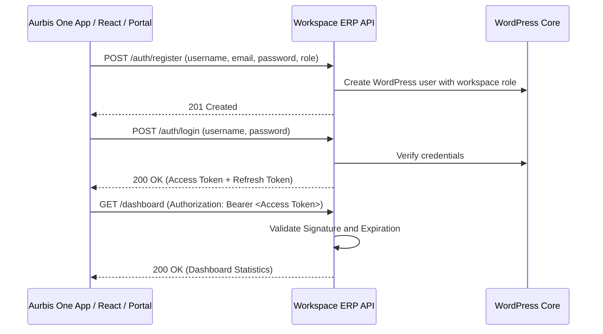

# Workspace ERP API - Operations & Integration Guide

This guide provides a comprehensive overview of the **Aurbis Workspace Management ERP API** WordPress plugin, including its architectural design, role-based access control, test credentials, and client endpoints workflow.

---

## 1. Plugin Contents & Modules

The plugin exposes a WordPress REST API under the `/wp-json/workspace-erp/v1` namespace.

| Module | Core Functionality | Database Table |
| :--- | :--- | :--- |
| **Authentication** | JWT secure token registration, login, logout, and token rotation. | Standard `wp_users` & `wp_usermeta` |
| **Dashboard** | Metrics cards (Total Buildings, Tenants, Occupancy, Revenue, ESG score) and charts. | Dashboard calculations aggregate table values |
| **CRM & Leads** | Capture inquiries, broker entries, opportunities, proposals, and visits. | `wp_workspace_leads`, `_opportunities`, `_proposals`, `_site_visits` |
| **Clients** | Master database for companies, lease contracts, and renewal dates. | `wp_workspace_clients` |
| **Workspace** | Property registry: Buildings, Floors, Cabins, Desks, and Meeting Rooms. | `wp_workspace_buildings`, `_floors`, `_workspaces`, `_seats`, `_meeting_rooms` |
| **Occupancy** | Real-time seat allocation, utilization rates, and check-in tracking. | `wp_workspace_occupancy` |
| **Visitor** | QR passes, check-in registration, and employee host pre-approval. | `wp_workspace_visitors`, `_visitor_passes` |
| **Facility** | Helpdesk tickets, technician assignments, work orders, SLAs, and schedules. | `wp_workspace_tickets`, `_work_orders`, `_maintenance_schedule` |
| **Asset** | Equipment register, warranties, depreciation, and movements. | `wp_workspace_assets`, `_asset_allocations`, `_asset_movements` |
| **Vendor** | Register suppliers, coordinate contracts, and log service history payments. | `wp_workspace_vendors`, `_vendor_payments` |
| **Billing** | Leases invoices generation, Razorpay integration, receipts, credit notes. | `wp_workspace_invoices`, `_payments`, `_receipts`, `_credit_notes` |
| **Sustainability** | Track ESG reading logs for energy (kWh), water (liters), waste, and carbon. | `wp_workspace_energy_usage`, `_water_usage`, `_waste_management`, `_carbon_tracking` |
| **Smart Building** | IoT devices integration, live sensor metrics, and access gate logs. | `wp_workspace_iot_devices`, `_sensor_data`, `_access_logs` |
| **HR & Workforce** | Employees register, payroll, shift rosters, leaves, and attendance logs. | `wp_workspace_employees`, `_attendance`, `_leaves`, `_shifts` |
| **Community** | Announcements broadcasting, community events calendar, and feedback. | `wp_workspace_announcements`, `_events`, `_service_requests` |
| **Mobile App** | Optimized routes for Aurbis One mobile app (dashboard, room booking, visitors). | Custom mobile-optimized controller views |
| **Reports** | Analytics dashboards for Revenue, Occupancy, SLA compliance, and ESG reports. | Aggregated report endpoints |
| **Notifications** | Transaction logs (Email, SMS, Push, WhatsApp alerts). | `wp_workspace_notifications` |
| **Audit Logs** | Tracks administrator actions, login histories, and changes. | `wp_workspace_activity_logs` |

---

## 2. Authentication & JWT Login Flow

The plugin secures REST endpoints via **JWT (JSON Web Token)** using the standard `HS256` encryption algorithm.

### Default Client Test Credentials

During plugin activation, standard mock user accounts are generated automatically for testing:

| Username | Password | Assigned Role | Capabilities / Permissions |
| :--- | :--- | :--- | :--- |
| `workspace_superadmin` | `123456` | `workspace_super_admin` | Full control over settings, users, approvals, and financials |
| `workspace_sales` | `salespass123` | `workspace_sales_manager` | Manage Leads, CRM, Clients database, and pipelines |
| `workspace_facility` | `facilitypass123` | `workspace_facility_manager` | Manage Maintenance Tickets, Vendors, Assets, and Visitors |
| `workspace_finance` | `financepass123` | `workspace_finance_manager` | Generate Leases Invoices, Track Payments and Revenue Reports |
| `workspace_hr` | `hrpass123` | `workspace_hr_manager` | Manage Employees Records, Attendance Logs, and Leaves |
| `workspace_tenant` | `tenantpass123` | `workspace_tenant_admin` | Manage Tenant Employees, Visitors Pre-approval, and Room Bookings |
| `workspace_employee` | `employeepass123` | `workspace_tenant_employee` | Schedule Meeting Rooms, Raise Helpdesk Tickets, and View Invoices |
| `workspace_security` | `securitypass123` | `workspace_security_staff` | Verify Visitor QR Passes and Check In/Out Entry |
| `workspace_vendor_user` | `vendorpass123` | `workspace_vendor` | View Assigned Work Orders and Update Status |

---

## 3. Role-Based Access Control Matrix (RBAC)

REST routes require specific capability headers validated by the JWT middleware:

| Capability / Permission | Super Admin | Sales | Facility | Finance | HR | Tenant Admin | Tenant Employee | Security | Vendor |
| :--- | :---: | :---: | :---: | :---: | :---: | :---: | :---: | :---: | :---: |
| **Manage Users & Settings** | Yes | No | No | No | No | No | No | No | No |
| **Manage CRM & Leads** | Yes | Yes | No | No | No | No | No | No | No |
| **Manage Clients** | Yes | Yes | No | No | No | No | No | No | No |
| **Manage Properties/Workspaces** | Yes | No | No | No | No | No | No | No | No |
| **Manage Facilities / Work Orders** | Yes | No | Yes | No | No | No | No | No | No |
| **Manage Billing & Invoices** | Yes | No | No | Yes | No | No | No | No | No |
| **Manage Sustainability (ESG)** | Yes | No | No | No | No | No | No | No | No |
| **Manage HR / Attendance** | Yes | No | No | No | Yes | No | No | No | No |
| **Manage Visitors Check-in** | Yes | No | Yes | No | No | Yes | Yes | Yes | No |
| **View Dashboard & Reports** | Yes | Yes | Yes | Yes | Yes | Yes | Yes | No | No |

---

## 4. Mobile App REST API Reference

The plugin exposes separate, fully functional mobile routes for the **Aurbis One** application, automatically filtering records by the authenticated tenant employee's identity and company:

* **GET `/mobile/dashboard`**: Fetch dashboard summary metrics (notifications count, active bookings count, pending visitors count, outstanding invoices sum).
* **GET `/mobile/bookings`**: Fetch booking lists.
* **POST `/mobile/meeting-room-booking`**: Reserve a cabin/meeting room slot.
* **GET `/mobile/visitors`**: Fetch registered visitor requests.
* **POST `/mobile/visitors`**: Add a pre-approved visitor request.
* **POST `/mobile/visitors/{id}/approve`**: Approve or reject check-in requests.
* **GET `/mobile/invoices`**: Fetch invoice lease totals and utility charges.
* **GET `/mobile/service-requests`**: Fetch helpdesk support tickets.
* **POST `/mobile/service-request`**: Raise a facility service ticket.
* **GET `/mobile/announcements`**: Fetch community bulletins.
* **GET `/mobile/events`**: Fetch community events calendar.
* **GET `/mobile/meeting-rooms`**: List available rooms.

---

## 5. Swagger UI Documentation

Access the interactive visual Swagger UI playground to execute mock requests and inspect response schemas:
* **Playground URL**: `/workspace-erp-docs` (Redirects to swagger templates index)

---

## 5. Modern Operations Dashboard Portal

The plugin serves a modern, glassmorphic executive dashboard:
* **Dashboard URL**: `/workspace-erp`
* **Features**: Live metrics cards, dynamic SVG trend charts, modals for creating leads, tickets, and booking rooms, and SMTP settings editor.
